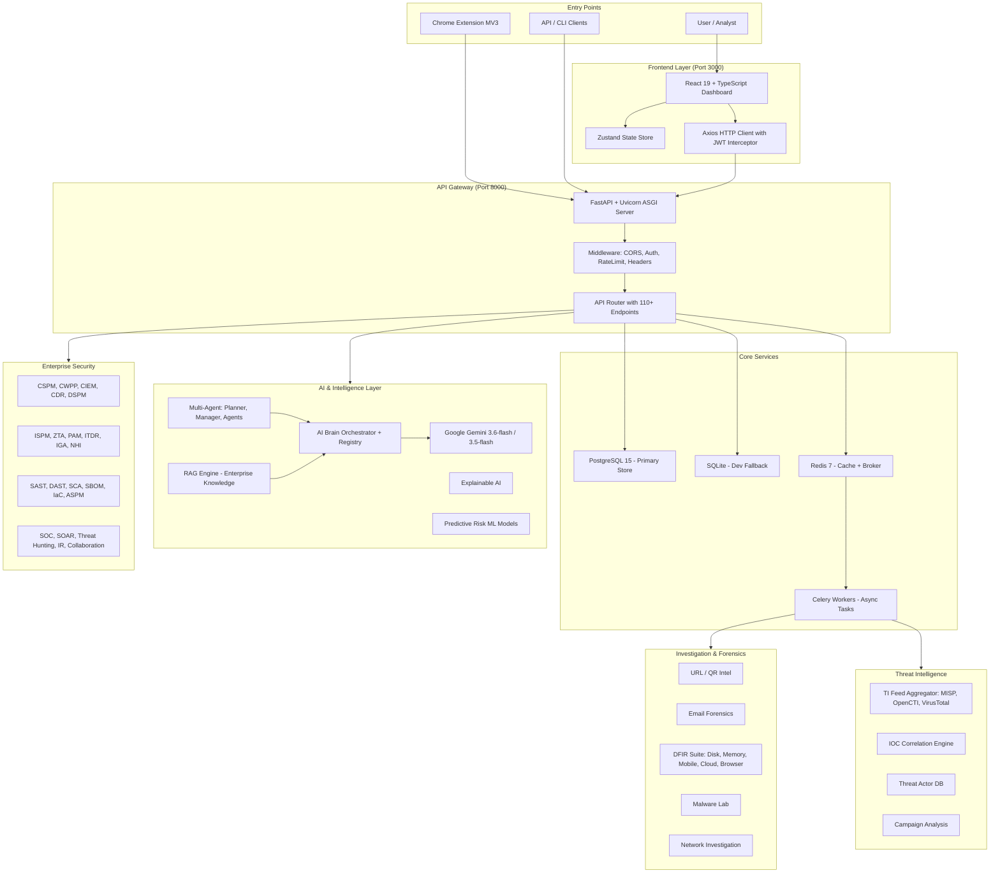
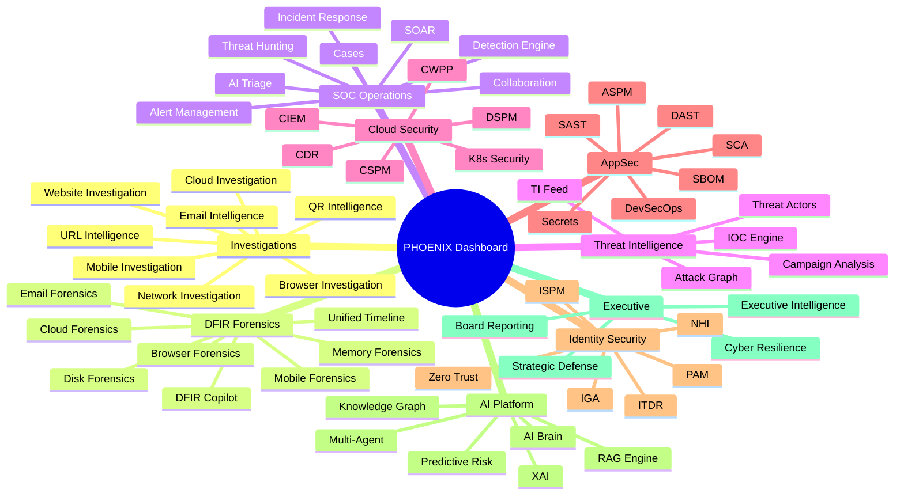
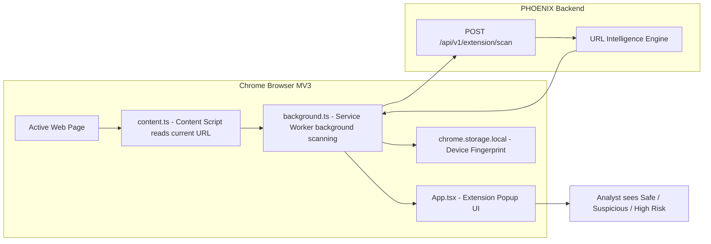
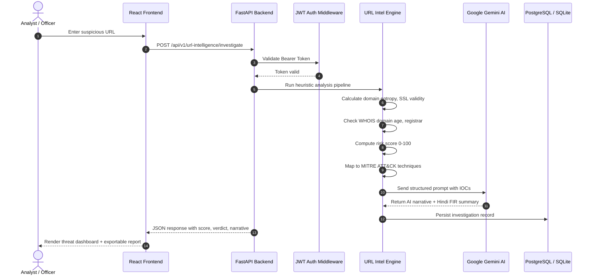
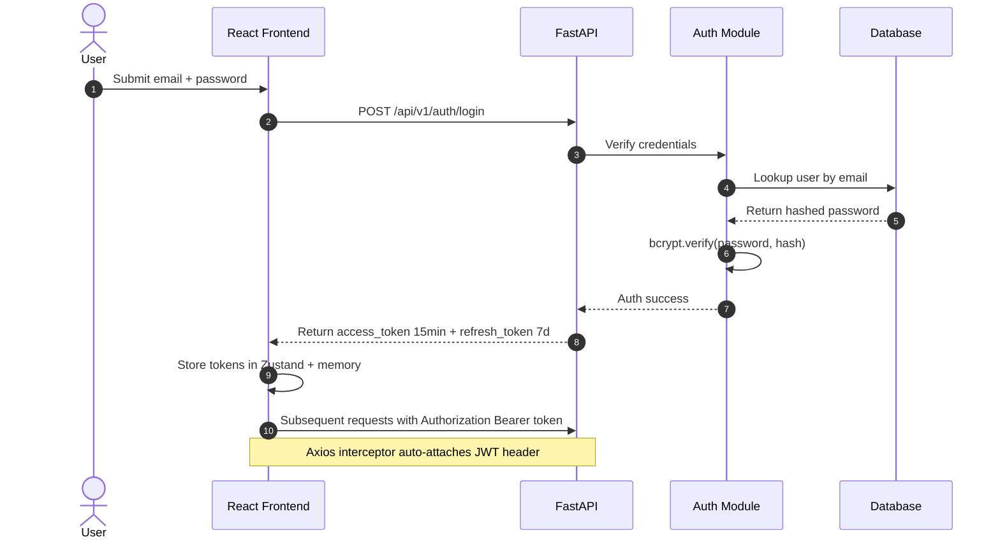
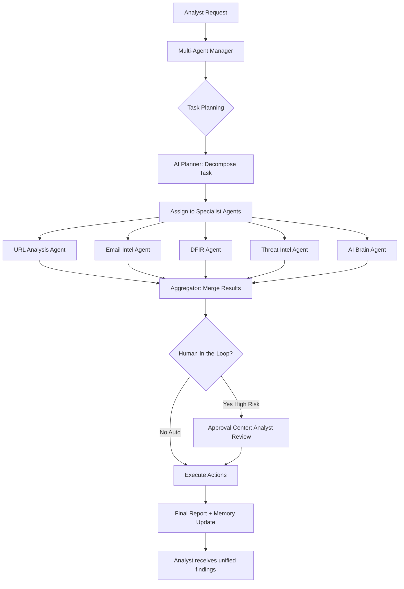
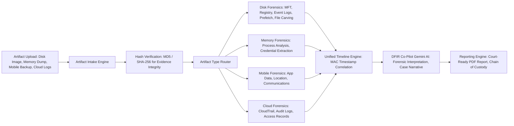
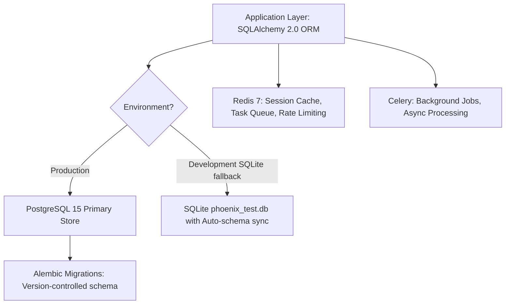
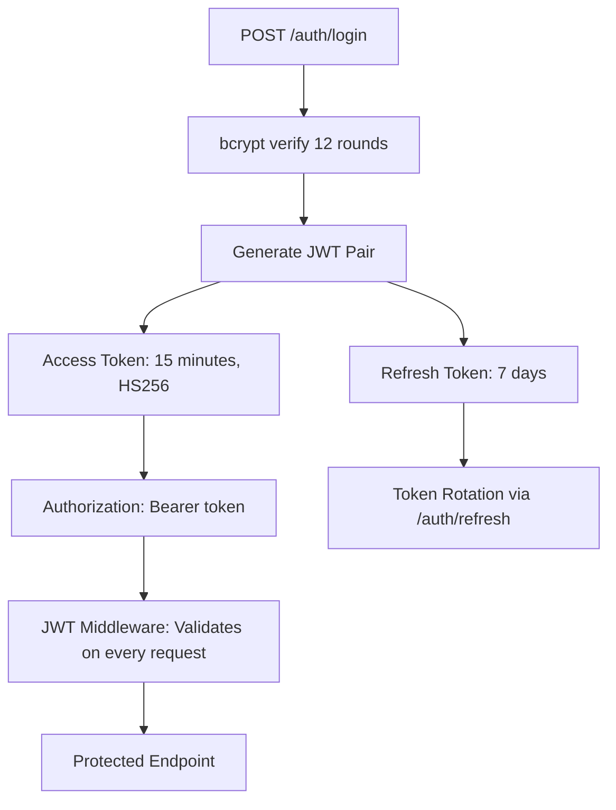
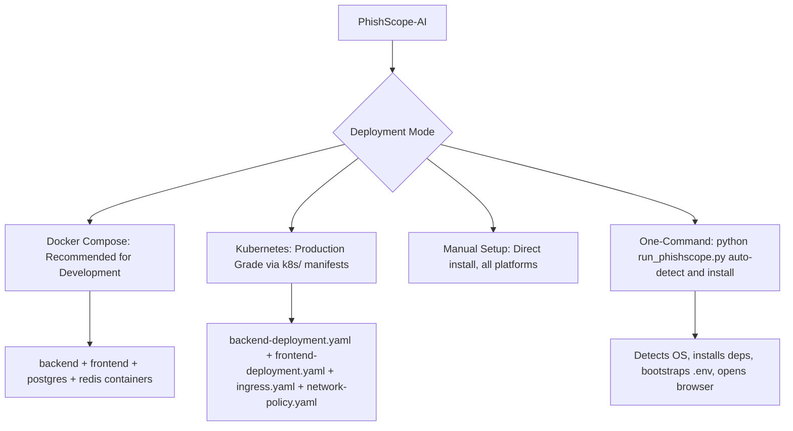

# PhishScope-AI (PHOENIX) — Comprehensive Project Summary

> **Version:** v0.1.0 — PHOENIX X  
> **Developer:** Umesh Gupta — National Forensic Sciences University (NFSU), Tripura Campus  
> **Domain:** Cyber Forensics & Information Security  
> **License:** MIT  
> **Repository:** [Hardy20102004/PhishScope-AI](https://github.com/Hardy20102004/PhishScope-AI)

---

## Table of Contents

1. [Project Overview](#1-project-overview)
2. [Problem Statement](#2-problem-statement)
3. [High-Level System Architecture](#3-high-level-system-architecture)
4. [Technology Stack](#4-technology-stack)
5. [Module Catalog — Backend (98 Modules)](#5-module-catalog--backend-98-modules)
6. [Frontend Module Catalog (58+ Pages)](#6-frontend-module-catalog-58-pages)
7. [Chrome Browser Extension](#7-chrome-browser-extension)
8. [API Endpoint Summary](#8-api-endpoint-summary)
9. [Data Flow Diagrams](#9-data-flow-diagrams)
10. [Database & Persistence Layer](#10-database--persistence-layer)
11. [AI & Intelligence Layer](#11-ai--intelligence-layer)
12. [Security Architecture](#12-security-architecture)
13. [Infrastructure & Deployment](#13-infrastructure--deployment)
14. [Quick Start & Configuration](#14-quick-start--configuration)
15. [Key Workflows](#15-key-workflows)
16. [Project Directory Structure](#16-project-directory-structure)
17. [Testing](#17-testing)
18. [Platform Compatibility](#18-platform-compatibility)

---

## 1. Project Overview

**PhishScope-AI**, codenamed **PHOENIX**, is an enterprise-grade, AI-powered cyber intelligence and digital forensics platform built for cybercrime investigators, SOC analysts, forensic professionals, and academic researchers.

It solves a critical gap in the cybersecurity industry: **no single unified platform** exists that covers the complete investigation lifecycle — from real-time browser-level phishing detection all the way through to DFIR (Digital Forensics & Incident Response), SOC operations, executive reporting, and strategic defense planning.

### Core Value Proposition

| Capability | Description |
|---|---|
| **Phishing Intelligence** | Real-time URL, QR code, and email phishing detection powered by ML heuristics and Google Gemini AI |
| **Digital Forensics (DFIR)** | Disk, memory, mobile, cloud, browser, and email forensics in one unified platform |
| **SOC Operations** | AI-assisted triage, threat hunting, incident response, SOAR, and collaboration |
| **Enterprise Security** | CSPM, CWPP, CIEM, ISPM, ZTA, PAM, ITDR, NHI, AppSec and DevSecOps suites |
| **Executive Intelligence** | Board-level risk reporting, cyber resilience, CTEM, and strategic defense planning |
| **AI Brain** | Multi-agent orchestration, RAG, knowledge graphs, explainable AI, and predictive risk |

---

## 2. Problem Statement

Cybercrime — especially phishing, business email compromise (BEC), and digital scams — caused over **$12.5 billion in losses in 2024** (FBI IC3 Report). Traditional security tools are siloed:

- Threat intelligence platforms don't talk to forensics tools.
- SOC analysts switch between 10+ dashboards for a single investigation.
- No unified platform for end-to-end scam investigation exists.

**PHOENIX** unifies this with a single, deployable, open-source system covering the complete security lifecycle.

---

## 3. High-Level System Architecture



---

## 4. Technology Stack

### 4.1 Backend

| Component | Technology | Version | Purpose |
|---|---|---|---|
| Language | Python | 3.11+ | Core backend language |
| Web Framework | FastAPI | 0.139+ | Async REST API server |
| ASGI Server | Uvicorn + uvloop | 0.51+ | High-performance async serving |
| ORM | SQLAlchemy | 2.0+ | Database abstraction layer |
| Migrations | Alembic | 1.18+ | Schema version management |
| Data Validation | Pydantic v2 | 2.13+ | Request/response validation |
| Auth | PyJWT + bcrypt | 2.13 / 4.0 | JWT + password hashing |
| Task Queue | Celery | 5.6+ | Async background jobs |
| Message Broker | Redis | 8.0 (client) | Cache + queue broker |
| Database | PostgreSQL | 15.x | Production primary store |
| Database Dev | SQLite | Built-in | Development/offline fallback |
| AI Integration | google-genai | 1.0+ | Google Gemini API client |
| Logging | structlog | 26.1+ | Structured JSON logging |
| HTTP Client | httpx | 0.28+ | Async HTTP calls |
| QR Decoding | pyzbar | 0.1.9 | QR code intelligence |
| ML | scikit-learn | 1.3+ | ML-based threat scoring |
| Graph Analytics | networkx | 3.0+ | Attack graph analysis |
| Web Scraping | beautifulsoup4 | 4.15+ | Website investigation |
| DNS | dnspython | 2.8+ | DNS intelligence lookups |
| Image Processing | Pillow | 12.3+ | Screenshot and image analysis |
| Data Science | pandas + numpy | 2.x | Analytics pipelines |
| Testing | pytest | 9.1+ | Automated test suite |
| Linting | ruff + mypy | 0.16 / 2.3 | Code quality enforcement |

### 4.2 Frontend

| Component | Technology | Version | Purpose |
|---|---|---|---|
| Framework | React | 19.x | Component-based SPA UI |
| Language | TypeScript | 6.0 | Static type safety |
| Build Tool | Vite | 8.x | Fast HMR + ESBuild bundler |
| State Management | Zustand | 5.x | Lightweight global state |
| UI Library | MUI (Material UI) | 9.x | Component design system |
| CSS Framework | Tailwind CSS | 3.4+ | Utility-first styling |
| HTTP Client | Axios | 1.18+ | API communication with JWT interceptor |
| Data Fetching | TanStack Query | 5.x | Server state + caching |
| Routing | React Router | v7 | SPA navigation |
| Charts | Recharts | 3.x | Analytics visualizations |
| Graph Viz | React Force Graph 2D | 1.29+ | Attack graph visualization |
| Flow / Diagrams | @xyflow/react | 12.x | Node-graph editors |
| Animations | Framer Motion | 12.x | Page transitions and micro-animations |
| Icons | Lucide React | 1.26+ | Security-themed SVG icons |
| Forms | React Hook Form + Zod | 7.x / 4.x | Form validation |
| Maps | Leaflet | 1.9+ | Geolocation intelligence |
| QR Scanning | jsqr | 1.4+ | In-browser QR decoding |
| i18n | i18next | 26.x | Internationalization |

### 4.3 Browser Extension

| Component | Technology |
|---|---|
| Framework | React + TypeScript |
| Build | Vite + Chrome Manifest v3 |
| Styling | Tailwind CSS |
| Icons | Lucide React |
| Runtime | Chrome Extension APIs (storage, tabs, runtime) |

### 4.4 Infrastructure

| Component | Technology | Purpose |
|---|---|---|
| Containerization | Docker + Docker Compose | Service orchestration |
| Orchestration | Kubernetes (k8s/) | Production deployment |
| IaC | Terraform | Cloud infrastructure provisioning |
| Web Server | Nginx | Frontend serving + reverse proxy |
| CI/CD | GitHub Actions (.github/) | Automated pipeline |

---

## 5. Module Catalog — Backend (98 Modules)

### 5.1 Core System Modules

| Module | Path | Key Components |
|---|---|---|
| Main App | app/main.py | FastAPI factory, lifespan hooks, CORS, exception handlers |
| Config | app/core/config.py | Pydantic Settings (env vars, Gemini config, JWT settings) |
| Security | app/core/security.py | JWT generation/verification, bcrypt password hashing |
| Startup Checks | app/core/startup_checks.py | Fail-fast validation: secret key, DB, env vars |
| Logging | app/core/logging.py | structlog structured JSON logging setup |
| Exceptions | app/core/exceptions.py | PhoenixException, global exception handlers |
| API Router | app/api/router.py | Central router mounting 110+ endpoint groups |
| Dependencies | app/api/deps.py | JWT auth dependency, DB session injection |
| Middleware | app/middleware/ | RequestContextMiddleware, security headers |

### 5.2 Investigation & Forensics Modules

| Module | Key Capabilities |
|---|---|
| URL Intelligence | ML-based URL threat scoring, domain entropy, WHOIS, SSL, typosquatting, MITRE mapping |
| Website Investigation | Screenshot rendering, DOM analysis, credential harvest detection, form extraction |
| QR Intelligence | QR code decode/analyze, UPI VPA deconstruction, embedded URL scoring |
| Email Intelligence | Header analysis, SPF/DKIM/DMARC validation, link extraction, BEC pattern detection |
| Malware Intelligence | YARA rule matching, static binary analysis, hash lookup, sandbox integration |
| Browser Investigation | Browser artifact analysis, history/cookie extraction, cached credential detection |
| Mobile Investigation | Android/iOS artifact analysis, app data extraction, location history |
| Network Investigation | PCAP analysis, DNS/IP investigation, C2 communication detection |
| Cloud Investigation | AWS/Azure/GCP log analysis, cloud-native IR |
| Disk Forensics | File carving (magic bytes), MFT/registry parsing, event log analysis, MAC timeline |
| Memory Forensics | Volatile memory analysis, process inspection, credential extraction |
| Mobile Forensics | Forensic artifact extraction from seized devices |
| Browser Forensics | History, cookies, saved passwords, download artifacts |
| Email Forensics | .eml/.msg parsing, phishing kit fingerprinting |
| Cloud Forensics | CloudTrail, GCP Audit, Azure Activity Log forensics |
| Unified Timeline | Cross-source timeline correlating all forensic artifacts |
| DFIR Co-Pilot | AI assistant for forensic interpretation and case building |
| Reporting Engine | Court-ready forensic report generation |

### 5.3 Threat Intelligence Modules

| Module | Key Capabilities |
|---|---|
| Threat Intel Feed | IOC aggregation from MISP, OpenCTI, VirusTotal, open feeds |
| IOC Engine | IOC correlation, deduplication, enrichment, feed publishing |
| Threat Actor | Threat actor profiling, TTP mapping, campaign attribution |
| Campaign Engine | Links incidents to known actor campaigns, timeline reconstruction |
| Attack Graph | MITRE ATT&CK-based attack path visualization |
| Reputation Engine | Real-time domain/IP reputation across 15+ sources |
| Timeline Intelligence | Temporal analysis of threat events |
| Predictive Intelligence | ML-based forecasting of threat actor activity |

### 5.4 SOC & Enterprise Operations Modules

| Module | Key Capabilities |
|---|---|
| AI Triage | Contextual AI alert prioritization, false-positive reduction |
| SOC Co-Pilot | LLM-powered analyst assistant with natural language queries |
| Alert Management | Multi-source alert ingestion, correlation, lifecycle management |
| Detection Engine | Custom SIEM-style detection rule authoring and execution |
| Detection Gap Analysis | Identifies blind spots in current detection coverage |
| Threat Hunting | Hypothesis-driven proactive hunting across logs and telemetry |
| Incident Response | Structured IR lifecycle: Detect, Contain, Eradicate, Recover |
| SOAR | Automated playbook execution for common incident types |
| Collaboration | Multi-analyst case sharing, annotation, investigation handoff |
| Cases | Case management, evidence chain-of-custody tracking |
| Executive Dashboard | SOC metrics, KPIs, and trend reporting for management |
| Digital Twin | Simulated replica of security environment for safe testing |

### 5.5 Cloud Security Modules (CNAPP)

| Module | Full Name | Key Capabilities |
|---|---|---|
| CSPM | Cloud Security Posture Management | Misconfiguration detection across AWS/Azure/GCP |
| CWPP | Cloud Workload Protection Platform | Container/VM runtime threat detection |
| CIEM | Cloud Identity and Entitlement Management | Excessive permission discovery |
| CDR | Cloud Detection and Response | Real-time cloud threat detection and response |
| DSPM | Data Security Posture Management | Sensitive data discovery and classification |
| K8s Security | Kubernetes Security Platform | Pod security, network policy, RBAC auditing |
| Multi-Cloud | Multi-Cloud Security Intelligence | Unified compliance across providers |
| Cloud Governance | Cloud Security Governance | Policy enforcement and compliance tracking |
| CTEM | Continuous Threat Exposure Management | Exposure scoring and remediation tracking |
| Command Center | AI Cloud Security Command Center | Unified cloud security operations dashboard |

### 5.6 Application Security (AppSec) Modules

| Module | Full Name | Key Capabilities |
|---|---|---|
| SAST | Static Application Security Testing | Source code vulnerability scanning |
| DAST | Dynamic Application Security Testing | Runtime application vulnerability testing |
| SCA | Software Composition Analysis | Open-source dependency vulnerability analysis |
| SBOM | Software Bill of Materials | Dependency inventory and license compliance |
| Secrets | Secrets Security Scanner | Leaked credential detection in code/configs |
| IaC | Infrastructure as Code Security | Terraform/CloudFormation misconfiguration |
| ASPM | Application Security Posture Management | Unified AppSec risk and posture dashboard |
| DevSecOps | Secure SDLC Platform | Security gates in CI/CD pipeline |
| AppSec Command Center | Enterprise AppSec Command Center | Unified AppSec operations interface |
| Developer Copilot | AI Developer Security Copilot | Inline code security assistance |

### 5.7 Identity Security Modules

| Module | Full Name | Key Capabilities |
|---|---|---|
| ISPM | Identity Security Posture Management | Identity risk discovery, posture scoring |
| ZTA | Zero Trust Architecture | Continuous trust evaluation, least-privilege enforcement |
| PAM | Privileged Access Management | Privileged session monitoring, credential vaulting |
| ITDR | Identity Threat Detection and Response | Credential theft and account takeover detection |
| IGA | Identity Governance and Administration | Role lifecycle management, access certification |
| NHI | Non-Human Identity Security | API keys, service accounts, secrets monitoring |
| AUTHN | Passwordless Authentication | MFA, FIDO2, passkey management |
| Federation | Federated Identity and SSO | SAML/OIDC federation management |
| Identity Intel | Identity Intelligence and Trust | Behavioral analytics for user accounts |
| Identity Command Center | Unified Identity Command Center | Single-pane identity security operations |

### 5.8 AI Platform Modules

| Module | Key Capabilities |
|---|---|
| AI Brain | Core AI orchestrator with provider registry, prompt optimization, reasoning engine |
| Multi-Agent | Autonomous agent planner, manager, aggregator, and human-in-the-loop approval |
| AI Memory | Persistent AI memory and context retention across sessions |
| AI Context | Dynamic context enrichment for AI decision-making |
| AI Triage | Automated alert triage using contextual AI scoring |
| RAG Engine | Retrieval-Augmented Generation for enterprise knowledge |
| Knowledge Graph | Graph-based threat knowledge representation |
| Knowledge Evolution | Dynamic knowledge base updating and learning |
| Prompt Platform | Enterprise prompt engineering and management |
| Model Manager | AI model versioning, deployment, and performance tracking |
| Explainable AI XAI | Interpretability and audit trails for AI decisions |
| Decision Engine | AI-driven autonomous decision support |
| Predictive Risk | ML-based risk forecasting and trend analysis |
| Predictive Intelligence | Threat actor activity and campaign forecasting |

### 5.9 Strategic & Executive Modules

| Module | Key Capabilities |
|---|---|
| Executive Intelligence | Board-level risk reporting, plain-language AI summaries |
| Strategic Defense | Long-term threat forecasting, defense roadmapping |
| Cyber Resilience | BCP, recovery assessment, resilience scoring |
| Cyber Governance | Policy compliance, regulatory alignment (ISO, NIST, CIS) |
| Cyber Fusion Center | Integrated intelligence fusion across all security domains |
| Cyber Command | Enterprise cyber operation command and control |
| CyberOS | Security operating system kernel abstraction |
| Orchestration | AI security orchestration across all platform modules |

---

## 6. Frontend Module Catalog (58+ Pages)

### 6.1 Page Domains



### 6.2 Key Frontend Pages

| Page | Route Domain | Description |
|---|---|---|
| Dashboard | / | Unified SOC command center with live metrics |
| URL Intelligence | /url-intel | Submit URLs for phishing analysis + ML scoring |
| QR Intelligence | /qr-intel | QR code decode, UPI fraud detection |
| Email Intelligence | /email-intel | Email forensics, BEC detection |
| Website Investigation | /website-investigation | DOM analysis, screenshot, form harvest detection |
| Malware Lab | /malware | File submission, YARA, sandbox |
| DFIR Suite | /forensics/* | Disk/memory/mobile/cloud forensics UIs |
| Unified Timeline | /timeline | Cross-source forensic event timeline |
| Threat Hunting | /threat-hunting | Hypothesis-based hunting workspace |
| Incident Response | /incident-response | IR lifecycle management |
| SOAR | /soar | Playbook management and execution |
| Attack Graph | /attack-graph | Interactive MITRE ATT&CK visualization |
| CSPM | /cspm | Cloud posture misconfiguration dashboard |
| ISPM | /ispm | Identity posture risk and discovery |
| ZTA | /zta | Zero trust policy and session monitoring |
| PAM | /pam | Privileged access session monitoring |
| SAST | /sast | Code vulnerability scan results |
| ASPM | /aspm | Application security posture |
| Multi-Agent | /multi-agent | AI agent orchestration and approval center |
| Executive Intelligence | /executive-intel | Board-level risk reports and AI summaries |
| Predictive Risk | /predictive-risk | ML-based risk forecasting dashboards |
| SOC Copilot | /copilot | NL query interface for investigations |
| Admin | /admin | User management, system settings |

---

## 7. Chrome Browser Extension

The extension operates as a **real-time phishing shield** running directly in the browser.

### Architecture



### Threat Badge Scoring

| Score Range | Badge | Color | Message |
|---|---|---|---|
| 75 to 100 | High Risk | Red | Strong phishing indicators detected |
| 40 to 74 | Suspicious | Amber | Proceed with caution |
| 0 to 39 | Safe | Green | No threats detected |

---

## 8. API Endpoint Summary

All endpoints are prefixed with `/api/v1/`. The platform exposes **110+ endpoint groups**.

### Core System Endpoints

| Endpoint Group | Prefix | Description |
|---|---|---|
| Health | /health | System health check (DB + cache status) |
| Version | /version | Platform version info |
| Auth | /auth | Login, refresh, logout |
| Users | /users | User CRUD and profile |
| Dashboard | /dashboard | Aggregated dashboard metrics |
| Tenants | /tenants | Multi-tenant management |

### Investigation Endpoints

| Endpoint Group | Prefix | Description |
|---|---|---|
| URL Intelligence | /url-intelligence | URL threat analysis |
| Website Investigation | /website-investigation | Deep website inspection |
| QR Intelligence | /qr-intelligence | QR code decode and analyze |
| Email Intelligence | /email-intelligence | Email forensic analysis |
| Malware Intelligence | /malware-intelligence | Malware scan and analysis |
| Browser Investigation | /browser-investigation | Browser artifact analysis |
| Mobile Investigation | /mobile-investigation | Mobile forensic analysis |
| Network Investigation | /network-investigation | Network traffic analysis |
| Cloud Investigation | /cloud-investigation | Cloud log forensics |

### DFIR Endpoints

| Endpoint Group | Prefix |
|---|---|
| Disk Forensics | /disk-forensics |
| Memory Forensics | /memory-forensics |
| Mobile Forensics | /mobile-forensics |
| Browser Forensics | /browser-forensics |
| Email Forensics | /email-forensics |
| Malware Analysis | /malware-analysis |
| Cloud Forensics | /cloud-forensics |
| Unified Timeline | /unified-timeline |
| DFIR Copilot | /dfir-copilot |
| Reporting Engine | /reporting-engine |

### Sample API Response

```json
POST /api/v1/url-intelligence/investigate
{
  "url": "http://paypa1-secure-login.xyz/verify",
  "threat_score": 94,
  "verdict": "PHISHING",
  "indicators": [
    "Domain registered 2 days ago",
    "Lookalike domain for paypal.com",
    "Login form detected with password field",
    "IP hosted on bulletproof hosting provider"
  ],
  "mitre_techniques": ["T1566.002", "T1598.003"],
  "ai_narrative": "This URL exhibits multiple high-confidence phishing indicators...",
  "hindi_summary": "यह URL एक संदिग्ध फिशिंग साइट है..."
}
```

---

## 9. Data Flow Diagrams

### 9.1 Phishing URL Analysis Flow



### 9.2 Authentication Flow



### 9.3 Multi-Agent AI Orchestration Flow



### 9.4 DFIR Investigation Flow



---

## 10. Database & Persistence Layer

### Architecture



### Key Database Features

| Feature | Implementation |
|---|---|
| ORM | SQLAlchemy 2.0 with async support |
| Migrations | Alembic with migration history |
| Dev Fallback | Auto-creates SQLite with phoenix_test.db |
| Auto Schema Sync | Startup checks auto-add missing columns (SQLite) |
| Admin Seeding | Auto-creates default admin at startup if absent |
| Connection Pooling | pool_pre_ping=True for connection health |
| Redis Cache | Session data, rate limit counters |
| Task Queue | Celery + Redis for background forensic jobs |

---

## 11. AI & Intelligence Layer

### AI Brain Architecture

The **AI Brain** is the central intelligence hub powering all AI features:

| Component | File | Purpose |
|---|---|---|
| Orchestrator | ai_brain/orchestrator.py | Master coordination of all AI operations |
| Registry | ai_brain/registry.py | Model/provider registration and selection |
| Providers | ai_brain/providers.py | Google Gemini API integration |
| Prompts | ai_brain/prompts.py | Enterprise prompt templates |
| Reasoning | ai_brain/reasoning.py | Multi-step chain-of-thought reasoning |
| Memory | ai_brain/memory.py | Persistent AI session memory |
| Context | ai_brain/context.py | Dynamic context assembly |
| Optimization | ai_brain/optimization.py | Prompt optimization and token management |
| Governance | ai_brain/governance.py | AI output validation and safety |

### Google Gemini Configuration

| Setting | Value |
|---|---|
| Primary Model | models/gemini-3.6-flash |
| Fast Model | models/gemini-3.5-flash |
| Fallback Models | gemini-flash-latest, gemini-3.1-flash-lite, gemini-3-flash-preview |
| Max Output Tokens | 2048 |
| Temperature | 0.2 (deterministic for forensic accuracy) |

### AI Capabilities

| Capability | Description |
|---|---|
| Threat Narrative | Translates technical IOCs into plain-language investigation summaries |
| Hindi FIR Summary | Generates localized Hindi reports for Indian law enforcement |
| SOC Co-Pilot | NL query interface: Show all IOCs from last 7 days linked to APT28 |
| DFIR Co-Pilot | Forensic interpretation and case building assistance |
| Multi-Agent | Autonomous decomposition and parallel execution of complex tasks |
| RAG | Enterprise knowledge retrieval for contextualized AI answers |
| Predictive Risk | ML models for forecasting threat activity |
| Explainable AI | Interpretability layer for all AI decisions |

---

## 12. Security Architecture

### Authentication & Authorization



### Security Controls

| Control | Implementation |
|---|---|
| Authentication | JWT HS256 with 15-minute access + 7-day refresh tokens |
| Password Hashing | bcrypt 4.0 with 12 salt rounds |
| Secret Key Guard | Fails startup in non-dev if using default SECRET_KEY |
| CORS | Configurable origins, open for development, restrict in production |
| Security Headers | security_headers.py: HSTS, XSS, frame-options |
| Request Context | Correlation ID per request for audit trails |
| Structured Logging | JSON audit logs with structlog |
| Rate Limiting | Redis-backed rate limiting middleware |
| Env Validation | Fail-fast startup on missing production env vars |
| HTTPS | Enforced via Nginx in production |

---

## 13. Infrastructure & Deployment

### Deployment Options



### Kubernetes Manifests

| File | Purpose |
|---|---|
| backend-deployment.yaml | Backend pod deployment spec |
| backend-service.yaml | Backend ClusterIP service |
| frontend-deployment.yaml | Frontend Nginx pod deployment |
| frontend-service.yaml | Frontend service |
| ingress.yaml | Ingress controller routing rules |
| network-policy.yaml | Pod-to-pod network isolation |

---

## 14. Quick Start & Configuration

### One-Command Launch

```bash
python run_phishscope.py
```

This auto-launcher:
1. Detects OS and environment
2. Installs all missing Python + Node dependencies
3. Bootstraps `.env` from `.env.example`
4. Starts PostgreSQL, Redis, Backend API, and Frontend
5. Polls until all services are healthy
6. Opens the dashboard in your browser automatically

### Access Points

| Service | URL | Default Credentials |
|---|---|---|
| Frontend Dashboard | http://localhost:3000 | admin@phoenix.ai / Phoenix@Admin123 |
| Backend API | http://localhost:8000 | — |
| API Docs Swagger | http://localhost:8000/api/v1/docs | — |
| API Docs ReDoc | http://localhost:8000/api/v1/redoc | — |

> **Warning:** Change default admin credentials immediately after first login.

### Key Environment Variables

| Variable | Default | Description |
|---|---|---|
| ENVIRONMENT | development | development / staging / production |
| SECRET_KEY | must set | HS256 JWT signing key minimum 256-bit |
| POSTGRES_SERVER | localhost | PostgreSQL host |
| POSTGRES_DB | phoenix | Database name |
| REDIS_URL | redis://localhost:6379/0 | Redis connection URL |
| GEMINI_API_KEY | must set | Google Gemini API key |
| GEMINI_PRIMARY_MODEL | models/gemini-3.6-flash | Primary AI model |
| ADMIN_EMAIL | admin@phoenix.ai | Bootstrap admin email |
| ACCESS_TOKEN_EXPIRE_MINUTES | 15 | JWT access token lifetime |
| REFRESH_TOKEN_EXPIRE_DAYS | 7 | JWT refresh token lifetime |

---

## 15. Key Workflows

### Workflow 1: Suspicious URL Investigation

```
1. Dashboard → URL Intelligence → New Investigation
2. Paste URL → Click Analyze
3. Platform computes: domain entropy, WHOIS age, SSL validity, typosquatting ratio
4. Gemini AI generates: threat narrative + Hindi FIR summary
5. MITRE ATT&CK techniques mapped
6. Results exported as court-ready report
```

### Workflow 2: Phishing Email Analysis

```
1. Dashboard → Email Forensics → Upload Email
2. Drop .eml / .msg file
3. Platform extracts: headers, SPF/DKIM/DMARC, links, attachments
4. BEC pattern matching applied
5. Phishing kit fingerprint checked
6. AI generates investigation summary
```

### Workflow 3: DFIR Case

```
1. Dashboard → DFIR → New Case → Select artifact type
2. Upload: disk image / memory dump / mobile backup / cloud logs
3. Hash verification (MD5 + SHA-256) — evidence integrity
4. Platform parses: MFT, registry, event logs, prefetch, deleted files
5. Unified timeline generated (cross-source MAC timestamps)
6. DFIR Co-Pilot (Gemini AI) interprets findings
7. Court-ready report generated
```

### Workflow 4: SOC Co-Pilot Query

```
1. Dashboard → SOC Co-Pilot
2. Type: Show all IOCs from last 7 days linked to APT28
3. Co-Pilot fetches from TI Feed + IOC Engine + Threat Actor DB
4. Correlates, deduplicates, and enriches results
5. Returns natural language findings + actionable recommendations
```

### Workflow 5: Real-Time Browser Protection

```
1. Install Chrome Extension from extension/dist/
2. Navigate to any website
3. Extension content script captures URL
4. Background service worker calls POST /api/v1/extension/scan
5. Result: Green Safe / Yellow Suspicious / Red High Risk badge
6. Click extension icon for full threat details
```

---

## 16. Project Directory Structure

```
PhishScope-AI/
├── run_phishscope.py              # Universal one-command launcher 54KB
├── start_mac.sh                   # macOS startup script
├── .env / .env.example            # Environment configuration
├── README.md                      # Main documentation
├── PROJECT_SUMMARY.md             # This file
│
├── backend/                       # FastAPI Python Backend
│   ├── app/
│   │   ├── main.py                # FastAPI app factory + lifespan hooks
│   │   ├── api/
│   │   │   ├── router.py          # Central router 110+ endpoint groups
│   │   │   ├── deps.py            # JWT auth + DB session dependencies
│   │   │   └── v1/endpoints/      # Endpoint handler modules 97 files
│   │   ├── core/
│   │   │   ├── config.py          # Pydantic Settings env management
│   │   │   ├── security.py        # JWT + bcrypt
│   │   │   ├── startup_checks.py  # Fail-fast startup validation
│   │   │   ├── logging.py         # structlog setup
│   │   │   └── exceptions.py      # PhoenixException handlers
│   │   ├── models/                # SQLAlchemy ORM models
│   │   ├── schemas/               # Pydantic request/response schemas
│   │   ├── middleware/            # RequestContext + security headers
│   │   ├── db/                    # Database session + base
│   │   │
│   │   ├── ai_brain/              # 9 files: orchestrator, registry, prompts
│   │   ├── multi_agent/           # 9 files: planner, manager, agents
│   │   ├── ispm/                  # 9 files: largest identity module 35KB router
│   │   ├── zta/                   # 9 files: zero trust architecture
│   │   ├── pam/                   # privileged access management
│   │   ├── [90+ additional feature modules]
│   │
│   ├── alembic/                   # Database migrations
│   ├── tests/                     # Test suite pytest
│   ├── requirements.txt           # 90 Python dependencies
│   └── pyproject.toml             # Build configuration
│
├── frontend/                      # React TypeScript Frontend
│   ├── src/
│   │   ├── App.tsx                # Root app component + router
│   │   ├── pages/                 # 58+ route-level page components
│   │   ├── features/              # 41 feature modules
│   │   ├── components/            # Reusable UI components
│   │   ├── stores/                # Zustand global state
│   │   ├── api/                   # API client layer
│   │   └── router/                # React Router configuration
│   └── package.json               # 45+ npm dependencies
│
├── extension/                     # Chrome Extension Manifest v3
│   ├── src/
│   │   ├── App.tsx                # Extension popup UI
│   │   ├── background.ts          # Service worker
│   │   └── content.ts             # Content script
│   └── manifest.json
│
├── docs/                          # Comprehensive documentation
│   ├── TECHNICAL_ARCHITECTURE_AND_THEORY.md
│   ├── OFFICIAL_PRESENTATION_GUIDE.md
│   ├── 16 module-specific architecture docs
│   └── 53 documentation subdirectories
│
├── k8s/                           # Kubernetes manifests 6 files
├── terraform/                     # Infrastructure as Code 2 files
└── logs/                          # Runtime logs gitignored
```

---

## 17. Testing

### Test Suite Location

```
backend/tests/
```

### Running Tests

```bash
cd backend
source .venv/bin/activate        # Linux/macOS

pytest tests/ -v                 # Run all tests
pytest tests/ -v --cov=app       # With coverage report
pytest tests/test_aspm.py -v     # Run specific test file
```

### Test Coverage Areas

| Test Domain | Coverage |
|---|---|
| Authentication endpoints | JWT login, refresh, user creation |
| ASPM module | Application security posture endpoints |
| URL Intelligence | Phishing detection heuristics |
| DFIR engines | Forensic analysis pipelines |
| AI context | Prompt assembly and AI response parsing |
| Database | ORM model CRUD operations |
| Startup checks | Secret key, DB connection, env validation |

---

## 18. Platform Compatibility

| Operating System | Docker | No-Docker | Status |
|---|---|---|---|
| Windows 11 22H2+ | Docker Desktop | SQLite fallback | Fully Supported |
| Windows 10 21H2+ | Docker Desktop | SQLite fallback | Fully Supported |
| Windows Server 2019+ | Docker Engine | Supported | Fully Supported |
| macOS Ventura 13.x+ | Docker Desktop | Supported | Fully Supported |
| macOS Sonoma 14.x+ | Supported | Apple Silicon | Fully Supported |
| Ubuntu 20.04 LTS+ | Docker Engine | Supported | Fully Supported |
| Debian 11+ | Supported | Supported | Fully Supported |
| RHEL / Rocky 8+ | Supported | Supported | Fully Supported |
| Kali Linux 2023+ | Supported | Supported | Fully Supported |
| WSL2 Ubuntu | via Docker Desktop | Supported | Fully Supported |
| Arch Linux Rolling | Supported | Supported | Fully Supported |

### Minimum Requirements

| Resource | Minimum | Recommended |
|---|---|---|
| Python | 3.11+ | 3.12+ |
| Node.js | 18+ | 20+ |
| RAM | 4 GB | 8 GB+ |
| Disk Space | 10 GB | 20 GB+ |
| CPU | 2 cores | 4+ cores |

---

## About

**Built with love by Umesh Gupta**

*National Forensic Sciences University (NFSU), Tripura Campus*

Developed as part of academic research in **Cyber Forensics & Digital Investigation**.

**Target Audience:** UP Police Cyber Cell, SOC Analysts, Forensic Investigators, Cybersecurity Researchers

**GitHub:** [Hardy20102004/PhishScope-AI](https://github.com/Hardy20102004/PhishScope-AI)
