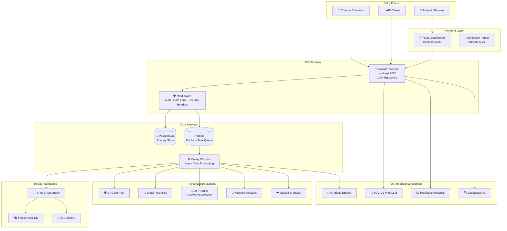

<!-- PHOENIX BANNER -->
<div align="center">

```
██████╗ ██╗  ██╗ ██████╗ ███████╗███╗   ██╗██╗██╗  ██╗
██╔══██╗██║  ██║██╔═══██╗██╔════╝████╗  ██║██║╚██╗██╔╝
██████╔╝███████║██║   ██║█████╗  ██╔██╗ ██║██║ ╚███╔╝
██╔═══╝ ██╔══██║██║   ██║██╔══╝  ██║╚██╗██║██║ ██╔██╗
██║     ██║  ██║╚██████╔╝███████╗██║ ╚████║██║██╔╝ ██╗
╚═╝     ╚═╝  ╚═╝ ╚═════╝ ╚══════╝╚═╝  ╚═══╝╚═╝╚═╝  ╚═╝
     PhishScope-AI — Enterprise Cyber Intelligence Platform
```

[](https://python.org)
[](https://fastapi.tiangolo.com)
[](https://react.dev)
[](https://typescriptlang.org)
[](https://postgresql.org)
[](https://redis.io)
[](https://docker.com)
[](./LICENSE)
[](./README.md)

**AI-Powered Phishing Detection, Digital Forensics & Enterprise Threat Intelligence**

[🚀 Quick Start](#-quick-start) • [📖 Documentation](./docs/) • [🐛 Bug Reports](./docs/bugfixes/) • [🤝 Contributing](./CONTRIBUTING.md)

</div>

---

## 📋 Problem Statement

Cybercrime — especially phishing, business email compromise, and digital scams — has become the most prevalent vector for financial fraud, data breaches, and identity theft globally. In 2024 alone, phishing attacks accounted for over **$12.5 billion** in losses (FBI IC3 Report).

Traditional security tools are siloed:
- Threat intelligence platforms don't talk to forensics tools.
- SOC analysts switch between 10+ dashboards to investigate a single incident.
- No single platform exists for **end-to-end scam investigation** — from initial URL/QR-code scan, through email analysis, all the way to DFIR and case reporting.

**PHOENIX / PhishScope-AI** solves this by providing a unified, AI-powered platform that covers the **complete investigation lifecycle** — from browser-level threat detection to enterprise forensics, SOC operations, and executive intelligence — in a single, deployable system.

---

## 👨‍💻 About the Developer

| Field | Detail |
|-------|--------|
| **Name** | Umesh Gupta |
| **Institution** | National Forensic Sciences University (NFSU), Tripura Campus |
| **Domain** | Cyber Forensics & Information Security |
| **Platform Version** | v0.1.0 — PHOENIX X |

---

## 💡 Why I Built This

As a cyber forensics student at **National Forensic Sciences University, Tripura Campus**, I worked on multiple real-world cases involving phishing scams targeting rural and semi-urban populations in Northeast India. The challenge was always the same: investigators had access to isolated tools — a URL scanner here, a malware sandbox there — but no unified workflow to move from "suspicious link received" to "complete forensic case file."

I built PhishScope-AI to:
1. **Bridge the gap** between real-time threat detection and deep forensic investigation.
2. **Democratize SOC capabilities** — making enterprise-grade threat intelligence accessible to smaller teams and academic institutions.
3. **Automate repetitive forensic tasks** using AI, freeing analysts to focus on high-value decision-making.
4. **Provide a research platform** for studying the evolving landscape of digital scams and phishing in the Indian cyber threat environment.

---

## ✨ Features

<details>
<summary><strong>🌐 URL & Web Intelligence</strong></summary>

- **Phishing URL Detection** — ML-based analysis of URL structure, domain age, registrar, and hosting patterns
- **Website Deep Inspection** — Screenshot rendering, DOM analysis, form extraction, and credential-harvest detection
- **QR-Code Intelligence** — Decode, analyze, and score QR codes for embedded malicious URLs
- **Reputation Engine** — Real-time domain/IP reputation lookup across 15+ threat intelligence sources
- **Browser Extension** — Real-time Chrome extension protection with in-page threat warnings

</details>

<details>
<summary><strong>📧 Email & Communication Intelligence</strong></summary>

- **Email Forensics** — Header analysis, SPF/DKIM/DMARC validation, link extraction, attachment analysis
- **Business Email Compromise (BEC) Detection** — AI pattern matching on email style and social engineering indicators
- **Phishing Kit Fingerprinting** — Identifies known phishing kit signatures from email artifacts

</details>

<details>
<summary><strong>🔍 Digital Forensics & Incident Response (DFIR)</strong></summary>

- **Disk Forensics** — Artifact extraction from disk images, timeline reconstruction
- **Memory Forensics** — Volatile memory analysis for malware detection and credential extraction
- **Mobile Forensics** — Android/iOS artifact analysis
- **Browser Forensics** — History, cookies, cached credentials, and download analysis
- **Cloud Forensics** — Log analysis for AWS/Azure/GCP incident response
- **Unified DFIR Timeline** — Cross-source timeline correlating all forensic artifacts
- **DFIR Co-Pilot** — AI assistant for forensic interpretation and case building

</details>

<details>
<summary><strong>🧠 AI-Powered Threat Intelligence</strong></summary>

- **Threat Intelligence Feed** — Aggregates IOCs from MISP, OpenCTI, VirusTotal, and open feeds
- **Threat Actor Profiling** — Tracks TTPs, campaigns, and actor attribution
- **Campaign Analysis Engine** — Links individual incidents to known threat actor campaigns
- **Attack Graph Visualization** — Maps attack paths and lateral movement using MITRE ATT&CK
- **Predictive Threat Intelligence** — ML-driven forecasting of threat actor activity
- **AI Triage Engine** — Auto-prioritizes alerts using contextual AI reasoning

</details>

<details>
<summary><strong>🏢 SOC & Enterprise Operations</strong></summary>

- **SOC Co-Pilot** — LLM-powered analyst assistant with contextual investigation guidance
- **SOAR Orchestration** — Automated playbook execution for common incident types
- **Threat Hunting Platform** — Hypothesis-driven hunting across logs and telemetry
- **Incident Response** — Structured IR lifecycle management (Detect → Contain → Eradicate → Recover)
- **Detection Engine** — Custom rule creation for SIEM-style alerting
- **Collaboration Hub** — Multi-analyst case sharing, annotation, and handoff

</details>

<details>
<summary><strong>☁️ Cloud & Application Security</strong></summary>

- **CSPM** — Cloud Security Posture Management for AWS/Azure/GCP
- **CWPP** — Cloud Workload Protection Platform
- **CIEM** — Cloud Identity and Entitlement Management
- **CDR** — Cloud Detection and Response
- **DSPM** — Data Security Posture Management
- **K8s Security** — Kubernetes workload and network policy analysis
- **Multi-Cloud Governance** — Unified compliance across cloud providers

</details>

<details>
<summary><strong>🛡️ AppSec & DevSecOps</strong></summary>

- **SAST** — Static Application Security Testing
- **DAST** — Dynamic Application Security Testing
- **SCA** — Software Composition Analysis (dependency vulnerabilities)
- **SBOM** — Software Bill of Materials generation
- **Secrets Scanner** — Detects leaked credentials in code
- **IaC Security** — Terraform/CloudFormation misconfiguration detection
- **ASPM** — Application Security Posture Management

</details>

<details>
<summary><strong>🔐 Identity Security</strong></summary>

- **ISPM** — Identity Security Posture Management
- **Zero Trust Architecture (ZTA)** — Enforce least-privilege access continuously
- **PAM** — Privileged Access Management monitoring
- **ITDR** — Identity Threat Detection and Response
- **NHI Security** — Non-Human Identity (API keys, service accounts) monitoring
- **Identity Intelligence** — Behavioral analytics for user accounts

</details>

<details>
<summary><strong>📊 Executive & Strategic Intelligence</strong></summary>

- **Executive Intelligence Dashboard** — Board-level risk reporting with plain-language summaries
- **Cyber Resilience & BCP** — Business continuity planning and recovery assessment
- **CTEM** — Continuous Threat Exposure Management
- **Strategic Defense Planning** — Long-term threat forecasting and defense roadmapping
- **Cyber Governance** — Policy compliance tracking and regulatory alignment

</details>

---

## 🏗️ Technology Stack

### Backend
| Component | Technology | Version |
|-----------|-----------|---------|
| Web Framework | FastAPI | 0.139+ |
| Language | Python | 3.11+ |
| ORM | SQLAlchemy | 2.0+ |
| Migrations | Alembic | 1.13+ |
| Task Queue | Celery | 5.3+ |
| Message Broker | Redis | 7.x |
| Database | PostgreSQL | 15.x |
| Auth | JWT (PyJWT) + bcrypt | — |
| Logging | structlog | 24.x |
| Validation | Pydantic v2 | 2.7+ |

### Frontend
| Component | Technology | Version |
|-----------|-----------|---------|
| Framework | React | 19.x |
| Language | TypeScript | 6.0 |
| Build Tool | Vite | 8.x |
| State | Zustand | 5.x |
| UI Library | MUI + Tailwind CSS | v9 / v3 |
| Data Fetching | TanStack Query | 5.x |
| Charts | Recharts | 3.x |
| Graphs | React Force Graph | — |
| Animations | Framer Motion | 12.x |
| Routing | React Router v7 | — |

### Browser Extension
| Component | Technology |
|-----------|-----------|
| Framework | React + TypeScript |
| Build | Vite + Chrome Manifest v3 |
| Styling | Tailwind CSS |

### Infrastructure
| Component | Technology |
|-----------|-----------|
| Container | Docker + Docker Compose |
| Orchestration | Kubernetes (k8s/) |
| IaC | Terraform (terraform/) |
| Web Server | Nginx (frontend) |
| ASGI Server | Uvicorn |

---

## 🗺️ System Architecture



---

## 🖥️ Platform Compatibility

| Operating System | Version | Docker Mode | No-Docker Mode | Status |
|-----------------|---------|-------------|----------------|--------|
| Windows 11 | 22H2+ | ✅ Docker Desktop | ✅ SQLite fallback | ✅ Fully Supported |
| Windows 10 | 21H2+ | ✅ Docker Desktop | ✅ SQLite fallback | ✅ Fully Supported |
| Windows Server | 2019+ | ✅ Docker Engine | ✅ | ✅ Fully Supported |
| macOS Ventura+ | 13.x+ | ✅ Docker Desktop | ✅ | ✅ Fully Supported |
| macOS Sonoma | 14.x+ | ✅ | ✅ Apple Silicon | ✅ Fully Supported |
| Ubuntu | 20.04 LTS+ | ✅ Docker Engine | ✅ | ✅ Fully Supported |
| Debian | 11+ | ✅ | ✅ | ✅ Fully Supported |
| RHEL / Rocky | 8+ | ✅ | ✅ | ✅ Fully Supported |
| Arch Linux | Rolling | ✅ | ✅ | ✅ Fully Supported |
| WSL2 (Ubuntu) | 20.04+ | ✅ via Docker Desktop | ✅ | ✅ Fully Supported |
| Kali Linux | 2023+ | ✅ | ✅ | ✅ Fully Supported |

**Minimum Requirements:**
- Python 3.11+
- 4 GB RAM (8 GB recommended)
- 10 GB free disk space
- Node.js 18+ (auto-installed by launcher)

---

## 🔑 Default Admin Credentials

> [!WARNING]
> These credentials are hardcoded for first-run convenience. **Change them immediately after your first login.**

```
Admin Email    :  admin@phoenix.ai
Admin Password :  Phoenix@Admin123
```

**To change the admin password after first login:**
1. Log in with the credentials above at `http://localhost:3000`
2. Navigate to `Settings → Account → Change Password`
3. Or via API: `PUT /api/v1/users/me` with `{"password": "your-new-password"}`

---

## 🚀 Quick Start

### One Command — Works on All Platforms

```bash
python run_phishscope.py
```

That's it. The launcher will:
1. ✅ Detect your OS and environment
2. ✅ Install all missing dependencies (Python packages + Node modules)
3. ✅ Bootstrap your `.env` configuration automatically
4. ✅ Start all services (Backend API, Frontend, Database, Redis)
5. ✅ Poll until all services are healthy
6. ✅ Open the dashboard in your browser automatically

---

## 🛠️ Manual Setup

### Option A — Docker (Recommended for Production)

> **Prerequisites**: Docker Desktop (Windows/macOS) or Docker Engine + Compose (Linux)

```bash
# 1. Clone the repository
git clone https://github.com/Hardy20102004/PhishScope-AI.git
cd PhishScope-AI

# 2. Copy and configure environment
cp .env.example .env
# Edit .env with your settings (optional for dev — defaults work)

# 3. Build and start all services
docker compose up --build -d

# 4. Run database migrations
docker compose exec backend alembic upgrade head

# 5. Access the platform
#    Frontend:   http://localhost:3000
#    API Docs:   http://localhost:8000/docs
#    Admin:      admin@phoenix.ai / Phoenix@Admin123
```

**Useful Docker commands:**
```bash
docker compose logs -f backend    # Stream backend logs
docker compose logs -f frontend   # Stream frontend logs
docker compose down               # Stop all services
docker compose down -v            # Stop + delete database volumes
```

---

### Option B — Manual (No Docker Required)

#### Step 1: Prerequisites

```bash
# Check Python version (must be 3.11+)
python --version

# Install Node.js if not present
# Windows: https://nodejs.org/en/download
# macOS:   brew install node
# Linux:   sudo apt install nodejs npm  (Ubuntu/Debian)
#          sudo dnf install nodejs npm  (RHEL/Fedora)

# Install PostgreSQL (skip if using SQLite fallback)
# macOS:   brew install postgresql@15 && brew services start postgresql@15
# Linux:   sudo apt install postgresql-15
# Windows: https://www.enterprisedb.com/downloads/postgres-postgresql-downloads
```

#### Step 2: Backend Setup

```bash
cd backend

# Create virtual environment
python -m venv .venv

# Activate virtual environment
# Windows:
.venv\Scripts\activate
# Linux / macOS:
source .venv/bin/activate

# Install dependencies
pip install -r requirements.txt

# Copy environment file
cp ../.env.example ../.env

# Run database migrations
alembic upgrade head

# Start the backend server
uvicorn app.main:app --host 0.0.0.0 --port 8000 --reload
```

#### Step 3: Frontend Setup

```bash
# In a new terminal window
cd frontend

# Install Node dependencies
npm install

# Start the dev server
npm run dev
# Frontend will be available at http://localhost:3000
```

#### Step 4: Extension Setup (Optional)

```bash
cd extension
npm install
npm run build

# Load in Chrome:
# 1. Open chrome://extensions/
# 2. Enable "Developer Mode"
# 3. Click "Load unpacked"
# 4. Select the extension/dist/ folder
```

---

## 📖 How to Use

### 1. Investigate a Suspicious URL

```
Dashboard → URL Intelligence → New Investigation
→ Paste URL → Click "Analyze"
→ View threat score, WHOIS, DNS, screenshots, and ML verdict
```

### 2. Run a Phishing Email Analysis

```
Dashboard → Email Forensics → Upload Email
→ Drop .eml or .msg file
→ View header analysis, link extraction, and risk assessment
```

### 3. Start a DFIR Investigation

```
Dashboard → DFIR → New Case
→ Select artifact type (Disk / Memory / Mobile / Cloud)
→ Upload artifact or connect data source
→ AI auto-generates timeline and forensic report
```

### 4. Use the SOC Co-Pilot

```
Dashboard → SOC Co-Pilot (top navigation)
→ Type natural language query: "Show me all IOCs from last 7 days linked to APT28"
→ Co-Pilot fetches, correlates, and explains findings in plain English
```

### 5. Threat Hunting

```
Dashboard → Threat Hunting → New Hunt
→ Select hypothesis template or write custom query
→ Execute across connected log sources
→ Save findings as detections or incidents
```

### 6. Real-Time Browser Protection (Extension)

```
1. Install the Chrome extension (see Extension Setup above)
2. Navigate to any website
3. Extension automatically scans in background
4. Red badge = High risk | Yellow = Suspicious | Green = Safe
5. Click extension icon for detailed report
```

---

## 📊 Expected Output

### Terminal (on `python run_phishscope.py`)

```
╔══════════════════════════════════════════════════════════════════╗
║         PHOENIX — PhishScope-AI  v0.1.0                         ║
║         AI-Powered Cyber Intelligence Platform                   ║
╠══════════════════════════════════════════════════════════════════╣
║  Developed by  :  Umesh Gupta                                    ║
║  Institution   :  National Forensic Sciences University          ║
║                   Tripura Campus                                 ║
║  GitHub        :  Hardy20102004/PhishScope-AI                    ║
╚══════════════════════════════════════════════════════════════════╝

[✓] Python 3.11.9 detected
[✓] Docker 25.0.3 detected — using Docker mode
[✓] Node.js 20.x detected

[STEP 1/5] Installing dependencies...
  Backend  .... done
  Frontend .... done

[STEP 2/5] Bootstrapping .env configuration...
  [✓] .env created from .env.example

[STEP 3/5] Starting services...
  [✓] PostgreSQL  running on localhost:5432
  [✓] Redis       running on localhost:6379
  [✓] Backend API running on http://localhost:8000
  [✓] Frontend    running on http://localhost:3000

[STEP 4/5] Admin Credentials
  ┌─────────────────────────────────────────┐
  │  Email    :  admin@phoenix.ai           │
  │  Password :  Phoenix@Admin123           │
  │  ⚠  CHANGE AFTER FIRST LOGIN!          │
  └─────────────────────────────────────────┘

[STEP 5/5] All systems operational. Opening browser...
  Logs → logs/phoenix_2026-08-05.log

Press Ctrl+C to stop all services.
```

### API Health Response

```json
GET http://localhost:8000/api/v1/health

{
  "status": "success",
  "data": {
    "status": "healthy",
    "database": "connected",
    "cache": "connected"
  }
}
```

### Sample URL Analysis Response

```json
POST /api/v1/url-intelligence/investigate
{
  "url": "http://paypa1-secure-login.xyz/verify",
  "threat_score": 94,
  "verdict": "PHISHING",
  "indicators": [
    "Domain registered 2 days ago",
    "Lookalike domain for 'paypal.com'",
    "Login form detected with password field",
    "IP hosted on bulletproof hosting provider"
  ],
  "mitre_techniques": ["T1566.002", "T1598.003"]
}
```

---

## 📁 Project Structure

```
PhishScope-AI/
├── run_phishscope.py           # ← Universal one-command launcher
├── docker-compose.yml          # Docker orchestration
├── .env.example                # Environment variable template
├── README.md                   # This file
│
├── backend/                    # FastAPI Python backend
│   ├── app/
│   │   ├── main.py             # FastAPI application factory
│   │   ├── api/
│   │   │   ├── router.py       # Central router (100+ endpoints)
│   │   │   ├── deps.py         # Dependency injection (Auth, DB)
│   │   │   └── v1/endpoints/   # API endpoint handlers
│   │   ├── core/
│   │   │   ├── config.py       # Settings (Pydantic)
│   │   │   ├── security.py     # JWT + password hashing
│   │   │   └── startup_checks.py  # Fail-fast startup validation
│   │   ├── models/             # SQLAlchemy ORM models
│   │   ├── schemas/            # Pydantic request/response schemas
│   │   ├── middleware/         # Request context + security headers
│   │   └── [95+ feature modules]
│   ├── requirements.txt
│   ├── pyproject.toml
│   └── alembic/               # Database migrations
│
├── frontend/                   # React TypeScript frontend
│   ├── src/
│   │   ├── App.tsx
│   │   ├── stores/             # Zustand state management
│   │   ├── pages/              # Route-level page components
│   │   └── components/         # Reusable UI components
│   └── package.json
│
├── extension/                  # Chrome Extension (MV3)
│   ├── src/App.tsx             # Extension popup UI
│   ├── manifest.json
│   └── package.json
│
├── docs/                       # Project documentation
│   ├── bugfixes/               # Bug fix documentation (audit Aug 2026)
│   └── [architecture docs per module]
│
├── k8s/                        # Kubernetes manifests
├── terraform/                  # Infrastructure as Code
├── mobile/                     # Mobile app (React Native)
└── logs/                       # Runtime logs (gitignored)
```

---

## 🔧 Environment Variables

Copy `.env.example` to `.env` before starting. Key variables:

```bash
# Application
ENVIRONMENT=development          # development | staging | production
SECRET_KEY=<generate-with-secrets.token_hex(64)>
ALGORITHM=HS256

# Database (PostgreSQL in production, SQLite in dev fallback)
POSTGRES_SERVER=localhost
POSTGRES_USER=phoenix
POSTGRES_PASSWORD=password
POSTGRES_DB=phoenix

# Redis
REDIS_URL=redis://localhost:6379/0

# Admin defaults (change in production!)
ADMIN_EMAIL=admin@phoenix.ai
ADMIN_PASSWORD=Phoenix@Admin123
```

Generate a strong secret key:
```bash
python -c "import secrets; print(secrets.token_hex(64))"
```

---

## 🧪 Running Tests

```bash
cd backend
source .venv/bin/activate      # Linux/macOS
# .venv\Scripts\activate       # Windows

pytest tests/ -v
pytest tests/ -v --cov=app     # With coverage report
```

---

## 🤝 Contributing

Please read [CONTRIBUTING.md](./CONTRIBUTING.md) before submitting pull requests.

**Branch strategy:**
- `main` — Stable production branch
- `main_v2` — Current development branch (active)
- `fix/*` — Bug fix branches
- `feat/*` — Feature branches

---

## 🛡️ Security

Found a vulnerability? Please read [SECURITY.md](./SECURITY.md) and **do not** open a public issue.

---

## 📄 License

This project is licensed under the MIT License — see [LICENSE](./LICENSE) for details.

---

## 📚 Research Context

This platform was developed as part of academic research in **Cyber Forensics and Digital Investigation** at the **National Forensic Sciences University (NFSU), Tripura Campus**, India. It aims to provide a practical, deployable tool for forensic investigators, SOC analysts, and cybersecurity researchers dealing with phishing, digital scams, and advanced persistent threats.

---

<div align="center">

**Built with ❤️ by Umesh Gupta**

*National Forensic Sciences University, Tripura Campus*

⭐ Star this repo if it helped you | 🐛 [Report a Bug](https://github.com/Hardy20102004/PhishScope-AI/issues) | 💬 [Discussions](https://github.com/Hardy20102004/PhishScope-AI/discussions)

</div>
