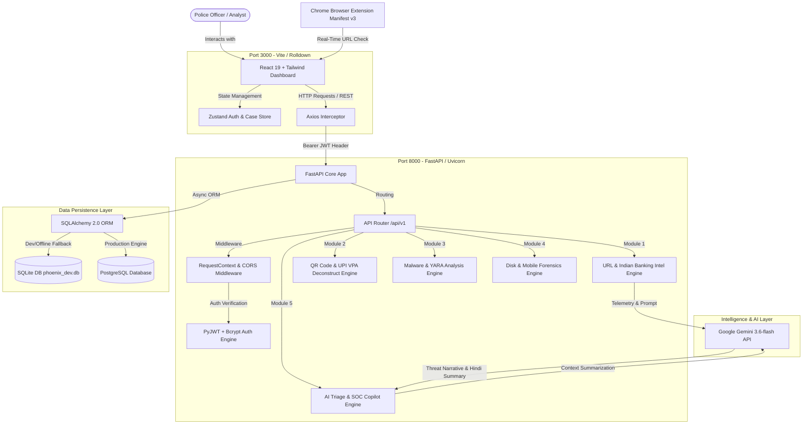
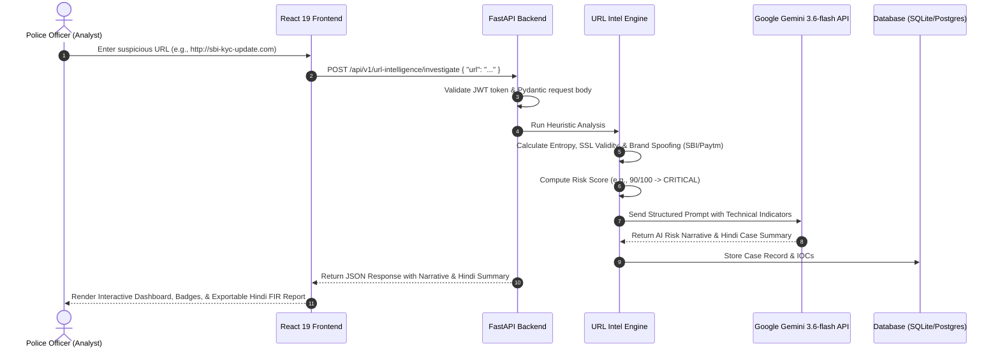

# PhishScope-AI 2.0 (PHOENIX-X) — Comprehensive Technical & Theoretical Documentation
========================================================================================
**Project**: PhishScope-AI Phishing & Cyber Crime Investigation Platform  
**Target Audience**: UP Police Cyber Cell, Senior Officials & Forensic Technical Evaluators  
**Developer**: Umesh Gupta (National Forensic Sciences University, Tripura Campus)  
**Version**: 2.0.0-gemini  

---

## 1. System Architecture & High-Level Flowchart

PhishScope-AI follows a decoupled **Client-Server Architecture** featuring a single-page React frontend, a FastAPI microservice backend, and integration with **Google Gemini 3.6-flash** AI models.

---

## 2. Technology Stack & Library Justifications

### A. Backend Ecosystem (Python 3.11 & FastAPI)

| Library / Tool | Version | Why We Use It (Technical Justification) |
| :--- | :--- | :--- |
| **FastAPI** | `^0.110.0` | Asynchronous, ultra-fast Python web framework built on Starlette and Pydantic. Generates automatic interactive OpenAPI (Swagger) documentation and enforces strong data validation. |
| **Uvicorn** | `^0.28.0` | Production-grade ASGI server utilizing `uvloop` and `httptools` to deliver non-blocking asynchronous I/O performance under heavy concurrent requests. |
| **Pydantic v2** | `^2.6.0` | Industry standard for data validation and schema serialization. Guarantees request/response type safety and prevents injection vulnerabilities. |
| **SQLAlchemy 2.0** | `^2.0.28` | Modern async ORM providing complete database abstraction. Allows seamless switching between local SQLite (field/offline development) and PostgreSQL (production). |
| **Google GenAI SDK** | `^0.1.0` | Native SDK for **Google Gemini 3.6-flash / 3.5-flash** integration. Used to synthesize technical IOCs into natural language narratives and localized Hindi FIR summaries. |
| **PyJWT & Passlib** | `^2.8.0` | Implements stateless JSON Web Token (JWT) authentication and cryptographic password hashing via `Bcrypt` (12 rounds) for secure police officer access. |
| **Structlog** | `^24.1.0` | Structured JSON logger that formats logs with request correlation IDs for production audit trails and debugging. |
| **Pytest** | `^8.0.0` | Test suite executing 176+ automated unit and integration tests across DFIR engines, AI context pipelines, and authentication routers. |

---

### B. Frontend Ecosystem (React 19 & Vite)

| Library / Tool | Version | Why We Use It (Technical Justification) |
| :--- | :--- | :--- |
| **Vite 8** | `^8.1.5` | Next-generation build tool using ESBuild/Rolldown. Replaces legacy Webpack to deliver sub-second hot module reloading (HMR) and optimized bundle production. |
| **React 19** | `^19.2.7` | Industry-leading UI component framework. Uses virtual DOM diffing and concurrent hooks for smooth, reactive dashboard updates. |
| **TypeScript** | `~6.0.2` | Compile-time static type system ensuring strict interface contracts between backend API schemas and frontend components. |
| **TailwindCSS** | `^3.4.19` | Utility-first CSS engine for rapid creation of custom dark-mode, glassmorphic cybersecurity command center user interfaces. |
| **Framer Motion** | `^12.42.2` | Production-grade animation library powering smooth page transitions, interactive modal popups, and toast alerts. |
| **Lucide React** | `^1.26.0` | High-quality SVG icon library providing intuitive visual indicators for hard drives, QR codes, threats, and security status badges. |
| **Zustand** | `^5.0.14` | Micro state-management library for storing JWT user sessions and active case contexts without the boilerplates of Redux. |
| **Axios** | `^1.18.1` | Promise-based HTTP client featuring automatic request interceptors for attaching `Authorization: Bearer <token>` headers to every API request. |
| **Recharts & Force Graph** | `^3.10.0` | Render interactive analytics charts and dynamic 2D graph visualizations for MITRE ATT&CK attack path exploration. |

---

## 3. End-to-End Execution & Analysis Flows

### Sequence Diagram: Phishing URL Analysis & Gemini AI Narrative Generation

---

## 4. Theoretical Breakdown of Core Forensic Engines

### 1. Indian Banking & UPI Fraud Detection Engine
- **Problem**: Cyber criminals target Indian citizens using deceptive URLs and fake UPI payment QR codes (impersonating SBI, HDFC, Paytm, PhonePe, IRCTC, Electricity Board).
- **Technical Working**:
  1. **Pattern Matching**: Regex heuristics identify deceptive VPA handle mismatches (e.g. display name `ElectricityBoard` pointing to VPA `scammer@paytm`).
  2. **Brand Spoofing Ratio**: Compares domain typosquatting distance (Levenshtein distance) against official bank domains.
  3. **Risk Scoring Matrix**: Assigns weights to domain age, missing SSL, suspended registrar history, and deceptive keywords.

### 2. Disk Image Forensics (DFIR) & File Carving
- **Problem**: Suspects delete evidence files (PDFs, EXEs, images) from seized laptops before police confiscation.
- **Technical Working**:
  1. **Hash Verification**: Calculates MD5/SHA-256 cryptographic signatures to guarantee evidence integrity in court.
  2. **File System Parsing**: Indexes Master File Table ($MFT), Registry Hives, Event Logs (`.evtx`), and Prefetch (`.pf`) files.
  3. **File Carving**: Scans unallocated disk sectors for magic byte header/footer signatures (e.g., `%PDF-1.`, `MZ\x90`, `\xFF\xD8\xFF`) to reconstruct deleted files without relying on file system metadata.
  4. **MAC Timeline**: Orders events by Modified, Accessed, and Created timestamps to visualize the exact sequence of a cyber attack.

### 3. Google Gemini AI Threat Narrative & Hindi Summarizer
- **Problem**: Technical forensic logs (IPs, MD5 hashes, YARA rules) are hard for non-technical Investigating Officers (IOs) to interpret quickly in FIRs or case diaries.
- **Technical Working**:
  1. Technical IOCs are structured into an optimized Markdown prompt.
  2. Prompt is sent to **Gemini 3.6-flash** via low-latency API streams.
  3. Gemini synthesizes a 3-part output: Plain-English Risk Narrative, Recommended Actionable Next Steps, and a localized **Hindi Summary Report (हिंदी सारांश)** suitable for official police case files.

---
*PhishScope-AI 2.0 — Developed for UP Police Cyber Cell Official Evaluation.*
