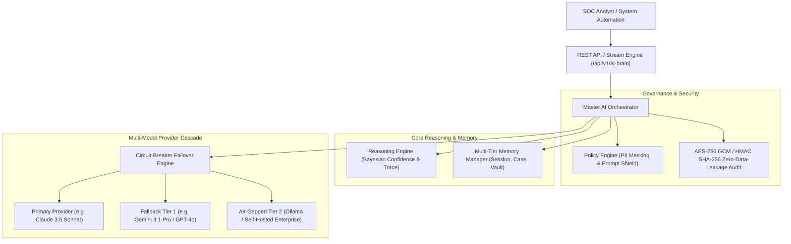

# PHOENIX X: AI Security Brain — Master Architecture Guide

## Executive Overview
The **PHOENIX AI Security Brain** is a specialized, modular, explainable, and robust enterprise intelligence subsystem built natively on top of PHOENIX Enterprise v1.0. Rather than treating artificial intelligence as a simplistic external chatbot wrapper, the AI Security Brain functions as an autonomous, multi-layered orchestration platform that coordinates every intelligent analysis, risk modeling, and threat mitigation action across the organization.

## Architectural Design Tenets
1. **Zero-Touch Modular Co-existence**: Built completely entirely within `backend/app/ai_brain/`, ensuring zero architectural friction or modification to PHOENIX v1.0 detection engines or SIEM connectors.
2. **Provider & Model Agnosticism**: Standardized abstraction via `ProviderInterface` isolates downstream investigation workflows from specific vendor API anomalies or deprecations.
3. **Explainable Artificial Intelligence (XAI)**: Every analytical inference yields a verified `decision_trace` outlining deductive step numbers, confidence scores, empirical evidence vault citations, and alternative competing hypotheses.
4. **Resilient Failover Cascade**: Integrated real-time circuit breakers automatically identify provider timeouts or 503 HTTP throttling, rerouting requests dynamically across secondary cloud or localized air-gapped LLMs without dropping client connections.
5. **Zero-Data-Leakage Compliance**: Strict pre-flight checking guarantees customer credit card numbers, SSNs, and AWS credentials are masked as `[REDACTED_SECRET]` prior to egress, complying strictly with OWASP Top 10 for LLM Applications and NIST AI RMF standards.

## Layer-by-Layer Anatomy

### 1. Model & Capability Registries (`app/ai_brain/registry.py`)
- **ModelRegistry**: Tracks exhaustive metadata for leading models (Claude 3.5 Sonnet, Gemini 3.1 Pro, GPT-4o, Mistral Large 2, DeepSeek-V3, Qwen 2.5, Llama 3.3, and Air-Gapped Local models). Maintains live token cost accounting metrics and availability statuses.
- **CapabilityRegistry**: Maps cybersecurity skills—such as *Threat Analysis*, *Evidence Explanation*, and *IOC Correlation*—to preferred models, operational fallbacks, and optimal inference parameters.

### 2. Context Builder & Evidence Aggregation (`app/ai_brain/context.py`)
- **EvidenceAggregator**: Pulls verified cryptographic indicators, PCAP logs, and threat feed scores from the PHOENIX Detection Engine, assigning immutable tracking tags (`[Finding ID: EVID-xxxx]`).
- **ContextBuilder**: Assembles structured analysis prompts incorporating Mandatory Organization Security Policies, Incident Timelines, Working Notes, and Multi-Turn Diagnostic Memory, utilizing token truncation to stay within context windows.

### 3. Multi-Tiered Memory & Reasoning Engines (`app/ai_brain/memory.py`, `reasoning.py`)
- **MemoryManager**: Supports multi-tier stateful caching across *Session*, *Case*, *Conversation*, and *Organization* tiers, implementing sliding-window condensation when diagnostic dialogues exceed turn thresholds.
- **ReasoningEngine**: Evaluates threat feed density against model output to compute composite Bayesian confidence scores (from 0.10 to 0.99), actively flagging inferences under `< 0.60` for Human-in-the-Loop review.
