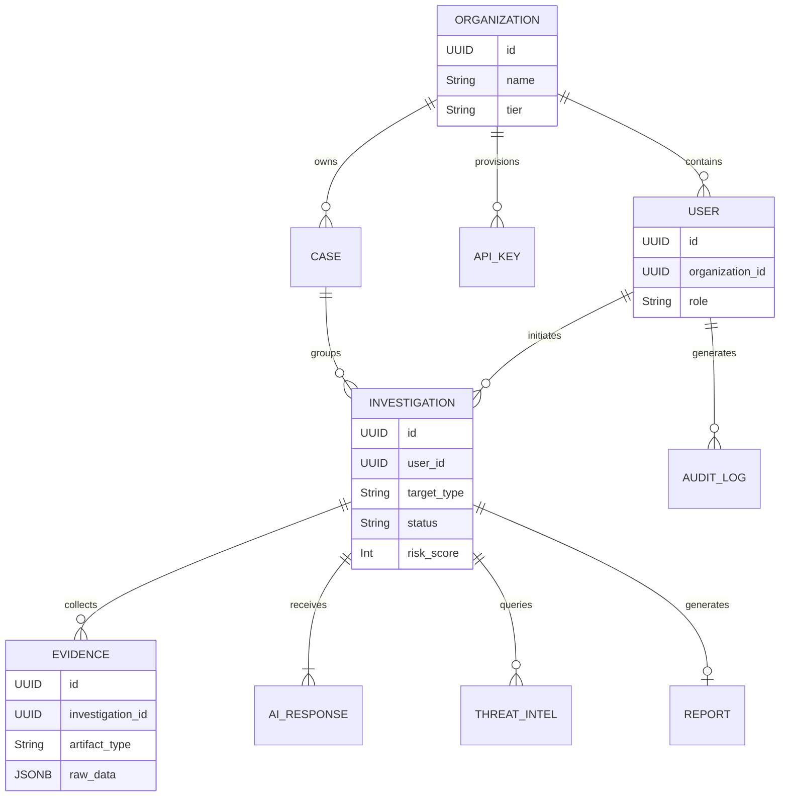
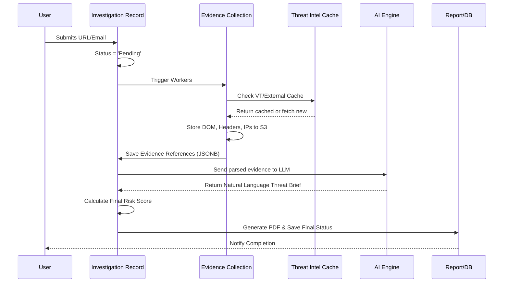

# PHOENIX: AI-Powered Digital Scam Investigation Platform
## Phase 3 – Database Architecture & Data Engineering (DDD)

---

## SECTION 1: Database Philosophy

The foundation of PHOENIX relies on data integrity, high availability, and the ability to cleanly separate structured metadata from unstructured evidence. 

- **Why PostgreSQL:** Chosen as the primary transactional database. It offers unparalleled ACID compliance, advanced indexing (GIN/GiST), robust Row-Level Security (RLS) necessary for multi-tenant SaaS, and exceptional JSONB support. JSONB is critical because investigation evidence from external APIs (like VirusTotal) arrives in highly variable, unstructured formats that we cannot strictly normalize.
- **Normalization Strategy:** Core business logic (Users, Organizations, Billing, Roles) will strictly follow Third Normal Form (3NF) to ensure data integrity and zero redundancy. Analytical and evidence data will follow a hybrid approach, storing normalized metadata alongside denormalized JSONB blobs to optimize read speeds.
- **Scalability:** Horizontal scaling via read replicas for analytical queries and reporting. Future-proofed for connection pooling (PgBouncer) and logical replication.
- **Maintainability:** Declarative schema migrations (e.g., Alembic/Flyway). Strong constraints (Foreign Keys, Check Constraints) to prevent orphan records.
- **Performance:** Strategic indexing, query optimization, and offloading heavy text searches to Elasticsearch/OpenSearch if native PostgreSQL Full-Text Search becomes a bottleneck.
- **Security:** Zero-trust principles. Database instances are placed in private subnets with no public internet access. End-to-end TLS encryption and AES-256 for data at rest.
- **Future Expansion:** The schema design inherently supports a Multi-Tenant architecture (Tenant IDs on all core tables) and partitioning by date for high-volume logs.

---

## SECTION 2: Database Domains

To prevent a monolithic "spaghetti" schema, the database is logically divided into distinct domains:

| Domain | Responsibility |
| :--- | :--- |
| **Authentication** | Passwords (hashed), MFA secrets, session tokens, login attempts. |
| **Users** | Profiles, preferences, API keys, avatar links. |
| **Organizations** | Tenants, billing tiers, domain allowlists, SSO configurations. |
| **Investigations** | The core entity representing a single scan (URL/Email). Tracks status, timestamps, and overall risk score. |
| **Evidence** | Pointers to S3 storage, raw JSON dumps from scanners, parsed metadata (IPs, hashes). |
| **Threat Intelligence** | Cached results from external vendors (VT, URLScan) to reduce API costs. |
| **AI** | Prompts used, LLM responses generated, token usage tracking. |
| **Reports** | Generated PDF/JSON report metadata and download links. |
| **Notifications** | Alerts sent to users/webhooks (status, payload, timestamps). |
| **Audit** | Immutable logs of system mutations (who changed what, when, from where). |
| **Analytics** | Aggregated daily metrics for the dashboard (investigations run, threats found). |
| **Settings** | Global platform configurations and feature flags. |
| **Case Management** | Groupings of multiple `Investigations` under a single `Case` for SOC analysts. |
| **API** | API key hashes, quota limits, rate-limit tracking. |
| **Future Modules** | Placeholders for Mobile device tracking, OCR models, Voice transcription metadata. |

---

## SECTION 3: Entity Discovery

*Note: Below are logical entities, not literal table definitions.*

### 1. Organization (Tenant)
- **Purpose:** Groups users and billing.
- **Relationships:** One-to-Many with `User`, `Investigation`, `API Key`.
- **Lifecycle:** Created upon signup. Never hard-deleted (soft delete only) for audit compliance.

### 2. User
- **Purpose:** Represents a human actor.
- **Relationships:** Many-to-One with `Organization`. One-to-Many with `Investigation` (creator).
- **Lifecycle:** Active, Suspended, or Soft-Deleted.

### 3. Investigation
- **Purpose:** The central transaction of the platform (e.g., scanning a URL).
- **Relationships:** One-to-Many with `Evidence`, `AI Response`. Many-to-One with `User`.
- **Ownership:** Owned by `User` and `Organization`.
- **Lifecycle:** Created -> Pending -> Processing -> Completed/Failed.

### 4. Evidence
- **Purpose:** The artifacts collected during an investigation.
- **Relationships:** Many-to-One with `Investigation`.
- **Ownership:** Bound to the `Investigation`.
- **Lifecycle:** Created during processing. Retained based on Organization data policies.

### 5. AI Response
- **Purpose:** The natural language explanation of the threat.
- **Relationships:** One-to-One (or One-to-Many for multi-language) with `Investigation`.

---

## SECTION 4: Entity Relationship Planning

### Relationship Explanations
- **One-to-One (1:1):** e.g., `Investigation` to `Report`. One completed investigation generates exactly one finalized report.
- **One-to-Many (1:N):** e.g., `Investigation` to `Evidence`. A single URL scan might collect multiple evidence items (DNS records, DOM snapshot, SSL cert).
- **Many-to-Many (N:M):** e.g., `Case` to `Investigation`. (Implemented via a mapping table). A major phishing campaign (Case) involves multiple URLs (Investigations), and a single URL might be linked to multiple overlapping Cases.

---

## SECTION 5: Data Flow

---

## SECTION 6: Data Classification

All data in PHOENIX is strictly classified to dictate encryption and handling requirements.

| Classification | Definition | Examples | Handling |
| :--- | :--- | :--- | :--- |
| **Public** | Data safe for anyone. | Public marketing URLs, generic platform stats. | Unencrypted at rest. |
| **Internal** | Safe for employees only. | Internal feature flags, system health metrics. | Encrypted at rest. |
| **Confidential** | Business sensitive. | Organization billing plans, anonymized aggregate scan data. | Encrypted at rest, IAM restricted. |
| **Sensitive** | PII and Auth data. | User emails, names, IP addresses. | Encrypted at rest, Strict RLS in DB. |
| **Highly Sensitive** | Secrets & Cryptography. | API Keys, MFA seeds, Password Hashes. | Encrypted at rest (KMS), never logged. |
| **Evidence** | Untrusted external data. | Malware samples, parsed phishing emails. | Quarantined in S3, stripped of scripts. |

---

## SECTION 7: Retention Policy

Enterprise customers demand control over their data lifecycle.

- **User Data:** Retained indefinitely until Account Deletion (GDPR Right to be Forgotten applies).
- **Evidence (S3 & JSONB):** 90 days default for standard tiers. 1-3 years for Enterprise compliance tiers.
- **AI Output:** Tied to Evidence retention.
- **Audit Logs:** Immutably stored for 3 years (cold storage after 6 months).
- **Notifications:** Hard deleted after 30 days.
- **Deleted Records:** Soft-deleted records are permanently purged via a CRON job after 30 days.
- **Backups:** Point-in-time recovery (PITR) for 35 days.

---

## SECTION 8: Performance Strategy

- **Indexes:** B-Tree indexes on all Foreign Keys and frequently searched columns (e.g., `created_at`, `status`). GIN indexes on `Evidence` JSONB columns to allow ultra-fast querying of specific JSON keys (e.g., finding all investigations where `evidence->>'ip' = '1.1.1.1'`).
- **Partitioning:** The `audit_logs` and `evidence` tables will be time-partitioned (by month) to ensure query speed remains constant as the database grows into the terabytes.
- **Caching:** Redis will cache user sessions, API rate limits, and frequent, expensive analytical queries (e.g., "Global Phishing Trends this week").
- **Large File Handling:** PostgreSQL will NEVER store large binaries (images, PDFs, PCAPs). It will only store the S3 URI/pointers.
- **Future Scaling:** Preparation for Read Replicas. Heavy dashboard analytical queries will be routed to the replica to prevent locking the primary transactional database.

---

## SECTION 9: Storage Strategy

| Data Type | Storage Solution | Rationale |
| :--- | :--- | :--- |
| **Relational Data** | PostgreSQL (RDS/Cloud SQL) | ACID compliance, referential integrity. |
| **Evidence Metadata** | PostgreSQL (JSONB) | Flexible schemas, indexable. |
| **Large Files (PDFs)** | Object Storage (AWS S3) | Cheap, infinitely scalable, CDN-ready. |
| **Screenshots/Images** | Object Storage (AWS S3) | High throughput, easily served via presigned URLs. |
| **Raw Malware / EMLs** | Object Storage (S3 - Isolated Bucket) | Strictly quarantined, versioned, restricted IAM access. |
| **Logs** | ElasticSearch / CloudWatch | Optimized for high-ingest, full-text search, and visualization. |

---

## SECTION 10: Security Strategy

- **Encryption:** AES-256 for all EBS volumes/PostgreSQL instances. TLS 1.3 for all database connections. 
- **Row Level Security (RLS):** PostgreSQL RLS policies will be enforced to ensure `Tenant A` can NEVER query `Tenant B`'s investigations, even if there is an application-layer bug.
- **Least Privilege:** The application connects to the DB using a restricted user role that only has `SELECT/INSERT/UPDATE/DELETE`. DDL commands (`CREATE`, `DROP`) are restricted to CI/CD migration runners.
- **Soft Delete:** A `deleted_at` timestamp column exists on all core entities. `DELETE` SQL commands are forbidden in application logic.
- **Audit Trail:** Triggers on core tables automatically insert row changes into an immutable `audit_logs` table.

---

## SECTION 11: Migration Strategy

- **Development:** Developers use Alembic/Flyway locally to auto-generate migration scripts.
- **Testing:** CI pipelines spin up a fresh PostgreSQL container, apply all migrations from scratch, and run unit tests.
- **Production:** Migrations are applied automatically during deployment.
- **Versioning:** Every change is a discrete, timestamped file (e.g., `V20260724_1200__add_mfa_secret.sql`).
- **Rollback:** Forward-only migrations are highly recommended for enterprise safety. If a bug is introduced, a new migration is written to fix it, rather than attempting a risky `DOWN` migration that might destroy data.

---

## SECTION 12: Database Naming Standards

- **Tables:** `snake_case`, plural, nouns (e.g., `users`, `investigations`, `api_keys`).
- **Columns:** `snake_case`, descriptive (e.g., `created_at`, `risk_score`). Avoid reserved words (`user`, `group`).
- **Primary Keys:** Always `id` (UUIDv4).
- **Foreign Keys:** `<singular_table_name>_id` (e.g., `organization_id`).
- **Indexes:** `idx_<table_name>_<column_name>` (e.g., `idx_users_email`).
- **Unique Constraints:** `uq_<table_name>_<column_name>`.
- **Boolean Columns:** Prefix with `is_`, `has_`, or `can_` (e.g., `is_active`, `has_mfa`).
- **Timestamps:** Standardize on `created_at`, `updated_at`, `deleted_at` (all in UTC).

---

## SECTION 13: Future Readiness

- **Enterprise & Multi-Tenant:** Every piece of data traces back to an `organization_id`, ensuring strict tenant isolation for large corporate clients.
- **AI & ML:** Unstructured data is preserved in JSONB and S3. When a new ML model is developed in the future, we have the historical raw datasets required to train it.
- **Threat Intelligence:** The caching layer prevents us from exhausting API limits of 3rd party vendors as our user base grows.
- **Analytics:** Data is structured such that an ETL pipeline (e.g., Airbyte/Snowflake) can easily sync the operational DB to a Data Warehouse for advanced enterprise dashboards.

---

## SECTION 14: Database Risks & Mitigation

| Risk | Impact | Mitigation Strategy |
| :--- | :--- | :--- |
| **JSONB Bloat** | High disk usage, degraded performance | Restrict JSONB size at the application layer. Offload massive raw payloads to S3, storing only summarized metadata in JSONB. |
| **Tenant Data Leakage** | Critical reputation damage | Implement native PostgreSQL Row-Level Security (RLS) tied to the application's JWT claims. |
| **Migration Locks** | Production downtime | Enforce zero-downtime migrations (e.g., adding columns without defaults, creating indexes `CONCURRENTLY`). |
| **Slow Full-Text Search** | Degraded UX | Monitor `LIKE` and `ILIKE` queries. Migrate complex search functions to ElasticSearch early if required. |
| **API Key Compromise** | Unauthorized DB Access | DB credentials injected via AWS Secrets Manager at runtime. Rotate DB passwords every 30 days automatically. |

---

## SECTION 15: Database Documentation Standards

As the database grows, the following living documents must be maintained in the `/docs/database/` repository:

1. **Schema Guide:** A human-readable data dictionary defining every table and column.
2. **ER Guide:** Auto-generated Entity-Relationship diagrams (using tools like SchemaSpy or DBeaver).
3. **Migration Guide:** Standard Operating Procedures (SOP) for writing and deploying migrations (especially locking vs. non-locking changes).
4. **Backup & Recovery Guide:** Step-by-step instructions for testing point-in-time recovery (PITR) in a staging environment (must be practiced quarterly).
5. **Naming Guide:** The source of truth for the standards defined in Section 12.
