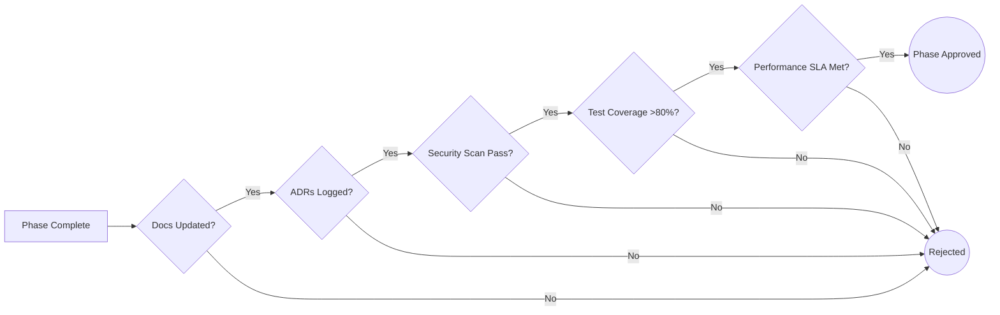

# PHOENIX Documentation Governance Guide

This guide establishes the engineering documentation standards for Project PHOENIX. It ensures that every architectural decision, phase review, improvement, and lesson learned is immutably preserved, allowing anyone joining the project to immediately understand the system's history and current state.

---

## 1. Documentation Structure

The `docs/` repository acts as the single source of truth for engineering knowledge.

| Directory | Purpose |
| :--- | :--- |
| `/phase-0X/` | Contains the goals, blueprints, and technical documentation specific to a development phase. |
| `/reviews/` | Houses the completed Phase Review Reports (one per phase) detailing achievements and technical debt. |
| `/architecture/` | High-level system diagrams, component interactions, and infrastructure topology. |
| `/database/` | ERDs, migration strategies, indexing policies, and data dictionary. |
| `/api/` | OpenAPI specs, authentication flows, rate limiting rules, and integration guides. |
| `/security/` | Threat models, RBAC matrices, audit compliance checklists, and incident response playbooks. |
| `/design-system/` | UI/UX guidelines, component documentation, typography, and color tokens. |
| `/ai/` | LLM prompt versioning, hallucination mitigation strategies, and model evaluation metrics. |
| `/testing/` | E2E test strategies, load testing results, and QA guidelines. |
| `/deployment/` | CI/CD pipelines, Kubernetes manifests, and infrastructure-as-code runbooks. |
| `/roadmap/` | Future engineering milestones and product feature timelines. |
| `/changelog/` | User-facing and developer-facing historical logs of platform changes. |
| `/decision-log/` | Architecture Decision Records (ADRs) explaining *why* choices were made. |
| `/meeting-notes/` | Standardized records of sprint planning, retrospectives, and architecture syncs. |
| `/product/` | Competitor analysis, personas, differentiation reviews, and go-to-market docs. |
| `/templates/` | Reusable Markdown boilerplates for standardizing team documentation. |

---

## 2. Phase Review System

A Phase Review is mandatory before any engineering phase is marked "Complete". This ensures rigorous quality control and alignment with business objectives. 

Upon completion of a phase, a **Review Report** is generated containing:
- **Executive Summary:** High-level overview of the phase.
- **Objectives vs Achievements:** What was planned vs what was actually delivered.
- **Deliverables:** Links to code, deployed artifacts, or docs.
- **Architecture & Design Decisions:** Major pivots from the original blueprint.
- **Problems Found & Solutions Applied:** Detailed post-mortem of roadblocks.
- **Risks & Technical Debt:** Known issues accepted to meet deadlines.
- **Future Improvements & Lessons Learned:** Takeaways for the next phase.
- **Approval Status:** Pass/Fail and reviewer sign-offs.

---

## 3. Architecture Decision Records (ADR)

The ADR system preserves the *context* behind engineering choices. When a developer asks, "Why didn't we use MongoDB?", the ADR provides the historical context, preventing redundant arguments.

**ADR Core Structure:**
- **Decision ID & Date:** e.g., `ADR-001 - 2026-07-24`
- **Problem:** What engineering challenge requires a decision?
- **Options Considered:** Alternatives evaluated (e.g., PostgreSQL vs MongoDB vs Cassandra).
- **Selected Option:** The final choice.
- **Reason:** Justification (performance, cost, team familiarity).
- **Trade-offs & Consequences:** What are we sacrificing? (e.g., "We gain ACID compliance but lose schema flexibility").
- **Status:** Proposed / Accepted / Deprecated.

---

## 4. The Professional Changelog

The `CHANGELOG.md` adheres to "Keep a Changelog" principles and Semantic Versioning.

**Categories:**
- `Added`: For new features.
- `Changed`: For changes in existing functionality.
- `Deprecated`: For soon-to-be removed features.
- `Removed`: For now removed features.
- `Fixed`: For any bug fixes.
- `Security`: In case of vulnerabilities.
- `Improved`: Performance or DX enhancements that don't change core functionality.
- `Known Issues`: Bugs pushed to production due to low severity.

---

## 5. Engineering Quality Gates

Before a phase is approved, the Technical Lead must verify the following Quality Gates:



- **Documentation:** Are APIs documented? Are ADMs written?
- **Security:** Has static analysis (SAST) passed? Are secrets out of the codebase?
- **Performance:** Do endpoints respond in <200ms? 
- **Scalability:** Can the new component scale horizontally?
- **Maintainability:** Is cyclomatic complexity low?
- **Accessibility:** Does the UI pass WCAG AA standards?

---

## 6. Project History & Onboarding System

To rapidly onboard new engineers:
1. **The Entry Point:** They read `/phase-00/project_blueprint.md` for the vision.
2. **The Backbone:** They read `/architecture/system_architecture.md` for the topology.
3. **The Timeline:** They read the `/changelog/` to see recent activity.
4. **The "Why":** They read `/decision-log/` (ADRs) to understand constraints.
5. **The "Next":** They read `/roadmap/` to see where the project is heading.

---

## 7. Templates

Below are the standardized templates for Project PHOENIX. Copy these into the `/templates/` directory and use them to standardize communication.

````carousel
```markdown
# Template: Architecture Decision Record (ADR)
**Decision ID:** ADR-[000]
**Title:** [Short title of the decision]
**Date:** YYYY-MM-DD
**Status:** [Proposed | Accepted | Deprecated | Superseded]
**Authors:** [Names]

## Context & Problem Statement
[Describe the problem. What is the engineering constraint or business requirement?]

## Options Considered
1. [Option 1] - [Brief description]
2. [Option 2] - [Brief description]

## Decision Outcome
**Selected Option:** [Option X]

### Rationale
[Explain why this option was chosen over the others. Focus on facts, benchmarks, and project alignment.]

### Consequences & Trade-offs
- **Positive:** [e.g., Faster read times]
- **Negative:** [e.g., Increased infrastructure cost, steeper learning curve]
```
<!-- slide -->
```markdown
# Template: Phase Review Report
**Phase:** [e.g., Phase 01 - Foundation]
**Review Date:** YYYY-MM-DD
**Reviewer:** [Name]
**Status:** [Approved | Conditionally Approved | Rejected]

## 1. Executive Summary
[Brief overview of what was built during this phase.]

## 2. Objectives vs. Achievements
| Objective | Status | Notes |
| :--- | :--- | :--- |
| [Objective 1] | [Done/Missed] | [Context] |

## 3. Architecture & Design Decisions
[Highlight major pivots from the initial blueprint.]

## 4. Problems & Solutions
- **Problem:** [Description]
- **Solution:** [How it was resolved]

## 5. Technical Debt & Risks
[What corners were cut? What needs fixing in the next phase?]

## 6. Lessons Learned
[What can the team do better next time?]
```
<!-- slide -->
```markdown
# Template: Sprint Planning Notes
**Date:** YYYY-MM-DD
**Sprint Focus:** [e.g., URL Investigation Module MVP]

## 1. Sprint Goals
1. [Goal 1]
2. [Goal 2]

## 2. Capacity & Availability
- [Team Member]: [X Days]

## 3. Scope & Story Points
| Ticket ID | Description | Points | Assignee |
| :--- | :--- | :--- | :--- |
| PHX-01 | Setup FastAPI Boilerplate | 3 | [Name] |

## 4. Blockers & Dependencies
- [e.g., Waiting on AWS access provisioning]
```
<!-- slide -->
```markdown
# Template: Bug Investigation Report
**Bug ID:** BUG-[000]
**Severity:** [Critical | High | Medium | Low]
**Date Reported:** YYYY-MM-DD

## 1. Description & Reproduction Steps
[What happened? How do we trigger the bug?]
1. [Step 1]
2. [Step 2]

## 2. Root Cause Analysis
[Technical explanation of why it failed. Use code snippets if helpful.]

## 3. Resolution Applied
[What was changed to fix it?]

## 4. Prevention Strategy
[How do we ensure this never happens again? e.g., Added an E2E test for this specific user flow.]
```
<!-- slide -->
```markdown
# Template: Feature Proposal
**Feature:** [Name]
**Proposer:** [Name]
**Target Phase:** [e.g., Phase 03]

## 1. Value Proposition
[Why do users need this? How does it differentiate PHOENIX?]

## 2. Technical Scope
[What modules need changing? UI, Backend, DB?]

## 3. Security Implications
[Does this introduce new attack vectors? PII handling?]

## 4. Estimated Effort
[T-Shirt sizing: Small, Medium, Large, X-Large]
```
````
