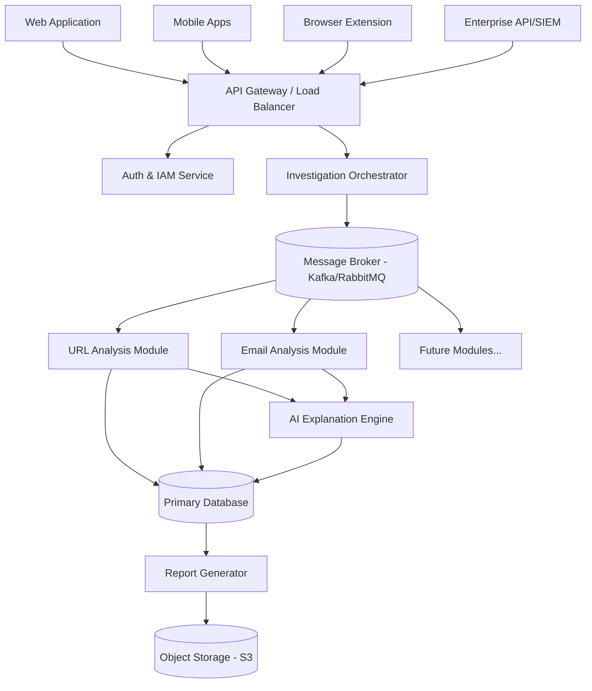

# PHOENIX: AI-Powered Digital Scam Investigation Platform
## Phase 0 Project Blueprint

---

## SECTION 1: Project Vision

### Mission
To build the world's most advanced, transparent, and comprehensive AI-powered platform capable of investigating, analyzing, and explaining every major type of phishing attack and online scam from a single, unified interface.

### Objectives
1. **Unify Threat Intelligence:** Consolidate isolated security investigation workflows into a single platform.
2. **Evidence-Driven Analysis:** Ensure every threat classification is supported by clear, reproducible evidence.
3. **AI-Powered Explainability:** Leverage AI not just to detect threats, but to explain the "what," "why," and "how" of the risk to users of all technical levels.
4. **API-First Architecture:** Build a robust, scalable backend that can serve web, mobile, desktop, and enterprise integrations interchangeably.
5. **Modular Scalability:** Design independent investigation modules that can be added, updated, or removed without impacting the core system.

### Scope
- **Initial Core Platform:** Architecture for a scalable SaaS platform with an API-first backend.
- **Investigation Capabilities:** Foundation for URL, website, and basic email phishing analysis.
- **Reporting Engine:** Automated, evidence-backed professional investigation reports.
- **User Management:** Role-based access control (RBAC), authentication, and tenant isolation.

### Out of Scope (Phase 0)
- Deepfake Scam Detection implementation.
- Native Mobile Apps (iOS/Android) and Desktop Applications (only API readiness is in scope).
- Automated remediation or active counter-measures (e.g., automated takedown requests).

### Success Criteria
- Architecture supports >10,000 concurrent investigations without degradation.
- API response times for core investigation initiation <200ms.
- 100% of risk scores include automated, human-readable explanations.
- Successful modular deployment of at least two independent investigation engines without system downtime.

---

## SECTION 2: Problem Statement

### Current Problems
The cybersecurity landscape is fragmented. Investigating a single scam often requires a practitioner to use a combination of VirusTotal, URLScan, whois lookups, sandboxes, and manual heuristics. There is no single "pane of glass" that handles diverse scam vectors (QR codes, OCR, crypto fraud, phishing) holistically.

### Existing Investigation Workflow
1. User receives a suspicious link or file.
2. Analyst extracts the artifact manually.
3. Artifact is submitted to multiple disparate, disconnected tools.
4. Analyst manually collates JSON/HTML outputs from tools.
5. Analyst attempts to synthesize a cohesive narrative.
6. A static, text-heavy report is generated.

### Pain Points
- **Context Switching:** Analysts lose time moving between tools.
- **Lack of Explainability:** Many tools provide a "malicious" flag (black-box) without explaining the exact mechanics of the scam.
- **Siloed Data:** Indicators of Compromise (IoCs) across different vectors (e.g., an SMS scam linking to a phishing site) are not correlated automatically.
- **High Barrier to Entry:** Junior analysts and regular users cannot interpret raw technical outputs.

### How PHOENIX Solves Them
PHOENIX provides a centralized, API-driven orchestration layer. It automatically queries necessary modules, correlates the findings, and utilizes AI to translate raw data (DOM analysis, SSL cert anomalies, OCR text) into an evidence-backed narrative, drastically reducing investigation time from hours to seconds.

---

## SECTION 3: Target Users

| Persona | Needs & Goals | Pain Points Addressed |
| :--- | :--- | :--- |
| **General User** | Wants to know "Is this safe?" in simple terms. | Translates complex threat data into simple, actionable advice. |
| **Cybersecurity Student** | Wants to understand *how* the attack works to learn. | Provides deep-dive explainability and evidence trails. |
| **SOC Analyst** | Needs to triage hundreds of alerts quickly and accurately. | Reduces MTTR (Mean Time To Respond) through automated correlation. |
| **Incident Responder** | Requires raw evidence, packet captures, and memory dumps. | Provides raw data access via API and advanced export capabilities. |
| **Digital Forensic Investigator** | Needs chain-of-custody and tamper-proof reports. | Immutable audit logs and cryptographically signed PDF reports. |
| **Organization (SMB)** | Wants to protect employees without a dedicated security team. | Easy integration via browser extensions and email gateways. |
| **Enterprise** | Needs RBAC, API integrations with SIEMs, and SSO. | API-first design, SAML/OIDC, and tenant-isolated data structures. |
| **Law Enforcement (Future)** | Requires evidential standards for prosecution. | Case management, immutable evidence locking, and clear attribution chains. |

---

## SECTION 4: Functional Requirements

### Must Have
- API Gateway for unified access.
- Modular investigation orchestrator.
- URL and Domain analysis module.
- AI-driven risk explanation generator.
- User authentication and authorization (JWT).
- Evidence storage and retrieval system.
- Basic Report Generation (PDF/JSON).

### Should Have
- Email header and attachment analysis module.
- Case management system (grouping investigations).
- Webhook support for investigation completion.
- Interactive dashboard for analytics.
- Rate limiting and API quota management.

### Future
- QR Code, OCR, and Image analysis modules.
- Voice (Vishing) and Deepfake analysis modules.
- Mobile applications (iOS/Android).
- Browser Extension for real-time protection.
- Social Media and messaging app integrations (Telegram/WhatsApp bots).

### Enterprise
- SAML/SSO integration.
- Active Directory sync.
- Custom threat intelligence feeds integration (STIX/TAXII).
- White-labeling of reports.
- Dedicated tenant architecture (Single-Tenant cloud options).

---

## SECTION 5: Non-Functional Requirements

- **Security:** AES-256 encryption at rest, TLS 1.3 in transit. Strict input validation, zero-trust backend architecture.
- **Performance:** System must handle asynchronous investigations with a message queue. UI must load in <2s.
- **Scalability:** Microservices architecture allowing independent horizontal scaling of investigation modules.
- **Availability:** 99.99% uptime target. Multi-AZ deployment.
- **Maintainability:** Strict adherence to SOLID principles, high test coverage (>85%), comprehensive API documentation (Swagger/OpenAPI).
- **Accessibility:** Web UI must comply with WCAG 2.1 AA standards.
- **Privacy:** GDPR and CCPA compliance. Data anonymization features for shared threat intelligence.
- **Compliance:** Architecture must support future SOC2 Type II and ISO 27001 certification requirements.

---

## SECTION 6: Version Roadmap

- **Version 1 (The Foundation):** Core API, Authentication, URL/Domain Module, AI Explanations, Basic Web Dashboard.
- **Version 2 (The Communicator):** Email Phishing Module, SMS/Message Parsing, PDF Reports, Webhooks, Case Management.
- **Version 3 (The Visual Investigator):** OCR, QR Code Module, Image Analysis, Browser Extension MVP.
- **Version 4 (The Mobile Defender):** iOS and Android Apps, Malware/APK static analysis module.
- **Version 5 (The Next-Gen Threat Platform):** Voice (Vishing) Analysis, Crypto Fraud Tracking, Deepfake Detection.
- **Enterprise Version (Parallel Track post-V2):** SSO, SIEM integrations, RBAC, On-Premise/Private Cloud deployment options.

---

## SECTION 7: System Architecture Overview

### High-Level Architecture

The architecture is built on a loosely-coupled, event-driven microservices pattern. 



### Major Components & Communication
1. **API Gateway:** The single entry point. Handles rate limiting, routing, and initial request validation.
2. **Auth & IAM:** Manages JWTs, API keys, and RBAC. Validates requests before passing to the orchestrator.
3. **Investigation Orchestrator:** The brain of the operation. Receives an investigation request, determines which modules are needed, and publishes events to the Message Broker.
4. **Message Broker:** Facilitates asynchronous communication. Modules subscribe to relevant topics, process data independently, and publish results back.
5. **Investigation Modules:** Independent microservices (e.g., URL, Email). They gather evidence and send it to the AI Engine.
6. **AI Explanation Engine:** Takes raw JSON evidence from modules, interfaces with an LLM, and generates structured, human-readable explanations.
7. **Storage Layer:** Relational DB for metadata/users, Document DB for complex investigation JSONs, and Object Storage for screenshots/PDFs.

### Future Expansion Strategy
New threat vectors are supported by simply writing a new Module that subscribes to the Message Broker. The Core Orchestrator requires minimal changes to route new data types to the new module.

---

## SECTION 8: Technology Recommendations

| Component | Technology | Rationale |
| :--- | :--- | :--- |
| **Frontend Web** | Next.js (React) + TailwindCSS | Next.js offers excellent SEO, Server-Side Rendering (SSR) for performance, and a robust ecosystem suitable for enterprise SaaS. |
| **Backend API** | Go (Golang) | Extremely high performance, low memory footprint, excellent concurrency (goroutines) perfect for handling thousands of asynchronous investigations and network requests. |
| **Database (Primary)** | PostgreSQL | ACID compliant, highly reliable, and supports JSONB for flexible schema designs needed for varied investigation data. |
| **Database (Cache)** | Redis | High-speed caching for rate limiting, session management, and storing immediate investigation states. |
| **Message Broker** | RabbitMQ / Apache Kafka | Decouples microservices. RabbitMQ is excellent for complex routing; Kafka is superior for high-throughput event streaming. |
| **AI Integration** | OpenAI API / Local LLMs (vLLM) | Start with OpenAI/Anthropic APIs for rapid prototyping; abstract behind an interface to allow switching to local, privacy-preserving LLMs for enterprise deployments. |
| **Object Storage** | AWS S3 (or MinIO for on-prem) | Industry standard for storing unstructured evidence (screenshots, PDFs, malware samples). |
| **Authentication** | Auth0 or Keycloak | Auth0 for speed to market; Keycloak for self-hosted enterprise requirements and open-source flexibility. |
| **Deployment/DevOps**| Kubernetes (EKS/GKE), Docker, GitHub Actions, Terraform | Standardized, scalable container orchestration. Infrastructure as Code (IaC) ensures repeatable, reliable deployments across dev/staging/prod environments. |

---

## SECTION 9: Project Folder Planning

A production-grade monorepo or carefully structured polyrepo approach. Assuming a monorepo structure for seamless early development:

```text
phoenix/
├── .github/                  # CI/CD workflows and actions
├── api-gateway/              # Entry point service (Rate limiting, routing)
├── frontend/                 # Next.js web application
│   ├── src/components/       # Reusable UI components
│   ├── src/pages/            # Next.js routes
│   └── src/lib/              # Frontend API clients
├── services/                 # Independent backend microservices
│   ├── auth/                 # Identity and Access Management
│   ├── orchestrator/         # Main business logic and message routing
│   ├── module-url/           # URL/Domain analysis engine
│   ├── module-email/         # Email parsing engine
│   ├── ai-engine/            # LLM prompt management and parsing
│   └── reporting/            # PDF and JSON report generation
├── packages/                 # Shared libraries across services
│   ├── database/             # Shared DB models and migrations
│   ├── logger/               # Standardized structured logging
│   └── events/               # Message broker schemas/protobufs
├── infrastructure/           # Terraform and Kubernetes manifests
│   ├── envs/                 # Prod, Staging, Dev configurations
│   └── modules/              # Reusable IaC modules
├── docs/                     # Architecture, API specs (OpenAPI), playbooks
└── scripts/                  # Local development bootstrapping scripts
```

---

## SECTION 10: Project Risks

| Risk Type | Description | Mitigation Strategy |
| :--- | :--- | :--- |
| **Technical** | LLM hallucinations providing incorrect safety advice. | Strictly prompt the LLM to only interpret provided factual evidence. Implement a deterministic fallback rule engine. |
| **Technical** | Module timeouts due to external API latency (e.g., whois). | Implement aggressive timeouts, circuit breakers, and async processing. Never block the main API thread. |
| **Business** | High API costs from external intelligence feeds and LLMs. | Implement heavy caching (Redis), optimize prompt sizes, and negotiate startup tiers with vendors. |
| **Security** | Handling malicious files/URLs leading to infrastructure compromise. | Strict sandboxing, never execute payloads directly. Use isolated, ephemeral worker nodes for analysis. |
| **Legal** | Storing PII found in analyzed emails or malicious payloads. | Implement aggressive PII redaction algorithms before data is sent to the LLM or stored in the database. |

---

## SECTION 11: Development Methodology

1. **Planning (Phase 0):** Architecture blueprinting, API contract definition (OpenAPI/Swagger), UI/UX wireframing.
2. **Design (Phase 1):** Create High-Fidelity Figma mockups. Finalize database schemas and message payload structures.
3. **Backend First:** Develop the API Gateway, Auth, Orchestrator, and one module (URL). Rely on mock data before integrating external tools.
4. **Frontend Integration:** Build the Next.js UI consuming the developed APIs. Focus on the core investigation flow.
5. **Testing Strategy:** 
   - Unit tests for all pure functions (Go/TS).
   - Integration tests for API endpoints.
   - End-to-End (E2E) tests using Playwright for critical user journeys.
6. **Deployment:** Fully automated CI/CD pipeline. Deploy to a staging environment on every merge to main. 
7. **Maintenance & Iteration:** Implement Datadog/Prometheus for observability. Setup alerting for module failures. Iterate based on user feedback.

---

## SECTION 12: Deliverables (Phase 0)

1. **Phase 0 Project Blueprint:** (This document).
2. **System Architecture Diagrams:** High-level and module-level Mermaid diagrams.
3. **API Contract (Draft):** Initial OpenAPI specification for the core `/investigate` endpoints.
4. **Database Schema ERD:** Entity-Relationship diagram for Users, Organizations, Investigations, and Evidence.
5. **Technology Stack Finalization:** Final sign-off on the tools and languages listed in Section 8.
6. **Security & Compliance Checklist:** Baseline requirements for initial launch.
