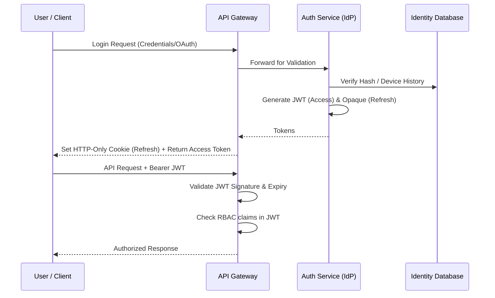
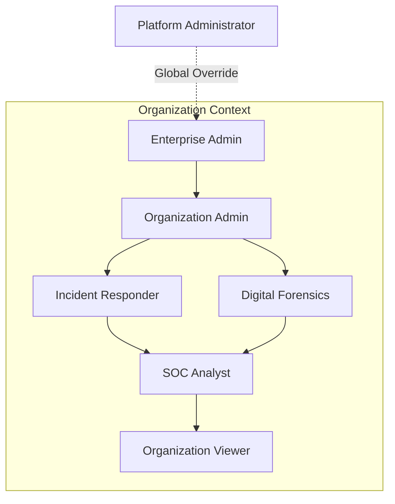

# PHOENIX: AI-Powered Digital Scam Investigation Platform
## Phase 4 – Identity & Access Management (IAM) Architecture

---

## SECTION 1: Identity Architecture

The PHOENIX identity architecture is built on a Zero Trust foundation. Every request is independently authenticated and authorized, regardless of network origin. 

- **Identity Provider (IdP):** In V1, PHOENIX will act as its own IdP utilizing a robust standard (e.g., Auth0 or a strictly configured Keycloak instance) to avoid building bespoke cryptographic identity handling. 
- **Authentication Flow:** Clients authenticate via standard OAuth 2.0 / OIDC flows (Authorization Code Flow with PKCE for web and mobile).
- **Authorization Flow:** Handled via short-lived JWT Access Tokens passed as Bearer tokens in the `Authorization` header. Scopes and Tenant IDs are encoded directly in the JWT payload.
- **Session Flow:** Stateless API interactions via JWT. State is maintained only via long-lived, securely stored Refresh Tokens.
- **Device Trust:** A secondary layer of verification. Even with a valid JWT, requests from unknown devices trigger step-up authentication.
- **Account Lifecycle:** Provisioning -> Active -> Suspended (by Admin/Billing) -> Soft-Deleted -> Hard-Deleted (Data purge).

---

## SECTION 2: User Types

PHOENIX serves a diverse user base, requiring strict segregation of capabilities.

| User Type | Responsibilities & Permissions |
| :--- | :--- |
| **Guest** | Unauthenticated. Can view public marketing pages only. |
| **Individual** | Standard B2C user. Can run basic investigations on their own account. |
| **Student** | Academic tier. Access to deeper technical evidence (DOM, PCAPs) for learning, subject to rate limits. |
| **SOC Analyst** | Tier 1/2 enterprise responder. Can view all cases in their Organization, run bulk scans, and generate reports. |
| **Incident Responder** | Tier 3 enterprise responder. Can export raw malware samples, edit investigation metadata, and manage threat intel rules. |
| **Digital Forensics Investigator** | Specialized role. Can access cryptographically signed audit logs and immutable chain-of-custody data. |
| **Organization Admin** | Manages billing, invites users to the tenant, and configures organization-wide settings (e.g., mandatory MFA). |
| **Enterprise Admin** | Manages multiple sub-organizations, configures SSO (SAML/OIDC), and sets global retention policies. |
| **Platform Administrator** | PHOENIX internal staff. Global break-glass access, system health monitoring, and global threat intel overrides. |
| **Gov. Agency (Future)** | specialized law enforcement view capable of cross-tenant, anonymized pattern analysis with legal subpoenas. |

---

## SECTION 3: Role-Based Access Control (RBAC)

The RBAC model utilizes a hierarchical structure where higher roles inherit permissions from lower roles within the same context (Tenant).

- **Roles:** Defined at the Organization level (e.g., `Viewer`, `Analyst`, `Admin`).
- **Permissions:** Granular actions (e.g., `investigations:read`, `investigations:create`, `billing:write`).
- **Permission Groups:** Logical groupings of permissions mapped to a Role.
- **Inheritance:** `Admin` inherits all permissions of `Analyst`, which inherits all permissions of `Viewer`.
- **Future Custom Roles:** The architecture supports dynamically mapping arbitrary combinations of permissions to custom roles (e.g., a "Report Generator Only" role).

---

## SECTION 4: Authentication Methods

- **Email & Password:** Baseline fallback. Requires high-entropy passwords (min 12 chars, checked against HIBP dictionaries).
- **Magic Link:** Primary B2C flow. High conversion, eliminates password fatigue, highly secure if email infrastructure is trusted.
- **OAuth (Google, GitHub, Microsoft):** Frictionless onboarding. GitHub appeals to students/devs; Microsoft appeals to enterprise trials.
- **MFA (TOTP/SMS):** Mandatory for Organization Admins and above. Optional (but encouraged) for others.
- **Passkeys (Future):** FIDO2 WebAuthn. Will eventually replace passwords as the primary authentication method.
- **Enterprise SSO (Future):** SAML 2.0 / OIDC integrations for direct Azure AD / Okta federated logins.

---

## SECTION 5: Session Management

- **Access Tokens:** Short-lived JWTs (15 minutes). Stateless. Cannot be revoked immediately without a token blocklist (which is heavy), hence the short lifespan.
- **Refresh Tokens:** Opaque strings. Long-lived (7 days rolling, 30 days absolute max). Stored securely in the DB.
- **Session Expiry:** Inactivity timeout (rolling) forces re-authentication to ensure the user is still present.
- **Remember Me:** Extends the absolute expiry of the Refresh Token, bounded by organizational security policies.
- **Device Sessions:** Each login generates a unique `Session ID` tied to a specific Refresh Token and Device Fingerprint.
- **Concurrent Sessions:** Limitable per organization (e.g., prevent account sharing by limiting to 3 concurrent sessions).
- **Session Revocation (Logout Everywhere):** Deleting all Refresh Tokens associated with a `user_id` instantly kills their ability to renew Access Tokens.

---

## SECTION 6: Device Trust

- **Device Registration:** First successful login from a new hardware/browser combination registers the device.
- **Device Fingerprinting:** Privacy-aware hashing of non-PII factors (Browser user-agent, OS version, screen resolution, time zone) to establish a baseline.
- **New Device Detection:** If a login attempt occurs from an unrecognized fingerprint, a "New Device Login" email is dispatched immediately.
- **Risk-Based Verification:** If a new device logs in from an "impossible travel" location (e.g., US at 1 PM, Russia at 2 PM), the login is blocked and requires email/MFA confirmation.
- **Trusted Device List:** Users can view their active devices in Settings.
- **Device Revocation:** Users or Admins can click "Revoke" on a specific device, destroying its associated Refresh Token instantly.

---

## SECTION 7: Account Security

- **Password Policy:** Min 12 characters. No arbitrary complexity rules (NIST guidelines). Checked against HaveIBeenPwned API on creation.
- **Password Reset:** Secure, time-limited, single-use token sent via email.
- **Email Verification:** Mandatory before account activation.
- **Account Recovery:** Requires MFA fallback codes (generated during setup) or Admin intervention.
- **Account Lockout:** 5 failed attempts locks the account for 15 minutes. 
- **Rate Limiting:** Strict IP-based and User-based rate limits on all auth endpoints (`/login`, `/register`).
- **Brute Force Protection:** Exponential backoff on failed login attempts.
- **Credential Stuffing Protection:** CAPTCHA/Turnstile triggers after 3 failed attempts from a single IP across any accounts.

---

## SECTION 8: Zero Trust Principles

1. **Least Privilege:** Users only have access to their specific Organization's data. Platform Admins do not have default read access to customer evidence.
2. **Continuous Verification:** Every API call requires JWT validation. High-risk actions (e.g., changing billing, deleting an organization) require immediate step-up MFA, even if the session is active.
3. **Context-Based Access:** A valid password is not enough. The context (IP, Device, Time) must also match expected patterns.
4. **Assume Breach:** Internal microservices do not trust each other implicitly. Service-to-service communication requires mutual TLS (mTLS).

---

## SECTION 9: Audit & Compliance

All IAM events are logged immutably in a dedicated `iam_audit_logs` table (and forwarded to a SIEM).

| Event Type | Data Captured |
| :--- | :--- |
| **Login / Logout** | User ID, Timestamp, IP Address, Device Fingerprint, Status (Success/Fail). |
| **Password Change** | User ID, Timestamp, IP Address. |
| **Permission/Role Change** | Actor ID (who did it), Target User ID (who changed), Old Role, New Role. |
| **Security Settings** | Actor ID, Toggle Changed (e.g., "Enforced MFA"), Timestamp. |
| **Administrative Actions** | Support staff impersonation, tenant overrides (highly monitored). |

---

## SECTION 10: Privacy & Compliance

- **GDPR Readiness:** Full support for Right to Access (Data Export) and Right to be Forgotten (Account Deletion).
- **Data Minimization:** Only collect essential IAM data (Email, Name). We do not collect phone numbers unless explicitly required for SMS MFA.
- **User Consent:** Granular opt-ins for telemetry, marketing, and shared threat intelligence during registration.
- **Privacy by Design:** Passwords are never stored in plaintext (Argon2id hashing). IP addresses in long-term logs are masked (e.g., zeroing the last octet) after 30 days.

---

## SECTION 11: Enterprise Readiness

- **Organizations/Tenants:** The core architectural boundary. Every user belongs to an Organization.
- **Teams / Dept Separation:** Within an Organization, `Investigations` can be tagged to specific "Teams" to restrict visibility.
- **Enterprise Policies:** Org Admins can enforce "MFA Required", "Max Session Length", and "Allowed IP Ranges".
- **Enterprise SSO (SAML/OIDC):** PHOENIX delegates authentication to the client's Okta/Azure AD, inheriting their corporate security policies.
- **SCIM (System for Cross-domain Identity Management):** Future requirement. Allows Enterprises to auto-provision and de-provision PHOENIX accounts when an employee joins or leaves the company.

---

## SECTION 12: Security Threat Analysis

| Threat | Mitigation Strategy |
| :--- | :--- |
| **Session Hijacking** | Access tokens are short-lived. Refresh tokens are HTTP-Only, Secure, SameSite=Strict cookies, inaccessible to JS. |
| **Credential Theft** | MFA requirements. Device Trust (new devices require email verification). |
| **Phishing of PHOENIX Users** | FIDO2 WebAuthn (Passkeys) are mathematically immune to phishing. |
| **Token Theft (DB Breach)** | Refresh tokens in the DB are stored as SHA-256 hashes, not plaintext. |
| **Replay Attacks** | JWTs include `jti` (JWT ID), `iat` (Issued At), and `exp` (Expiry) claims. |
| **CSRF** | Use `SameSite=Strict` cookies. APIs require `Authorization: Bearer` headers (immune to CSRF). |
| **XSS** | JWTs are *never* stored in `localStorage`. Content Security Policy (CSP) headers block inline scripts. |
| **Insider Threats** | Audit logs track all Platform Admin actions. Access to customer DBs requires break-glass procedures. |
| **Privilege Escalation** | JWT roles are verified server-side. Users cannot tamper with JWT payloads without invalidating the signature. |

---

## SECTION 13: User Experience

Security must not cripple usability.
- **Registration:** 2-step process. Enter email -> Click magic link -> Set password/name later.
- **Login:** Clean UI. Auto-detects if the email belongs to an Enterprise SSO domain and redirects them smoothly.
- **MFA Enrollment:** Provide clear QR codes, manual entry fallback, and immediate generation of printable recovery codes.
- **Organization Invitation:** Secure invite links valid for 48 hours. When clicked, auto-binds the user to the inviting Organization.

---

## SECTION 14: Recommended Documentation

To ensure the IAM implementation is correctly utilized, the following living documents must be created in `/docs/security/`:

1. **Authentication Guide:** Details OAuth flows, JWT structures, and cookie policies for frontend developers.
2. **Authorization (RBAC) Guide:** The exact matrix of Roles vs. Permissions.
3. **Security Architecture Guide:** Documenting encryption standards, secrets management (AWS KMS/Vault), and network boundaries.
4. **Enterprise Admin Guide:** Customer-facing documentation on how to configure SAML/SSO and enforce MFA.

---

## SECTION 15: IAM Roadmap

- **MVP:** Email/Password, JWT Access/Refresh tokens, Basic Roles (Admin, User), Magic Links.
- **Version 2:** OAuth (Google/GitHub), Mandatory MFA (TOTP), Granular Permissions, Audit Logging.
- **Version 3:** Device Trust (Fingerprinting & Revocation), Impossible Travel detection, Passkeys (WebAuthn).
- **Enterprise:** SAML/OIDC SSO Integration, Enforceable Enterprise Policies (IP whitelisting).
- **Future:** SCIM automated provisioning, Government FedRAMP compliance adaptations.
